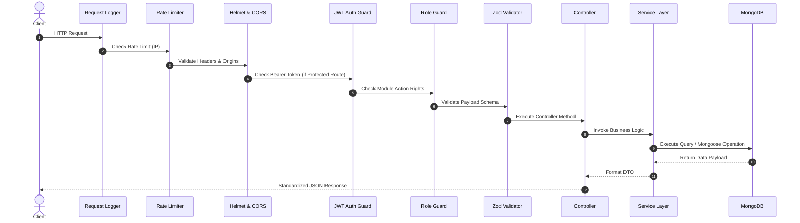

# HolidayCity - API Overview & RESTful Architecture Specification

**Version:** 1.0  
**Status:** Approved  
**Project Name:** HolidayCity  
**Document Type:** API Specification & Integration Guide  
**API Version:** `v1` (`/api/v1`)  

---

## 1. Technical Overview

The **HolidayCity API** is built using a modern, scalable Node.js + Express RESTful architecture. It operates on a dual-access design:

1. **Public Website APIs:** Lightweight, read-optimized endpoints for content delivery (destinations, packages, itineraries, blogs, FAQs) and lead acquisition forms (enquiries, newsletter, contact).
2. **Protected Admin APIs:** Robust, role-governed endpoints secured with JSON Web Tokens (JWT) and Granular Role-Based Access Control (RBAC) for lead management, content editing, and platform settings.

---

## 2. Technology Stack & Core Libraries

| Layer / Concern | Technology Selection | Purpose & Implementation |
| :--- | :--- | :--- |
| **Runtime Environment** | Node.js (v20+ LTS) | Asynchronous non-blocking event loop execution |
| **Web Framework** | Express.js | RESTful routing, custom middleware pipelines |
| **Database ODM** | MongoDB Atlas + Mongoose | Schema validation, population, aggregation pipelines |
| **Authentication** | JWT (AccessToken + RefreshToken) | Short-lived Access Tokens (15m), HTTP-Only Refresh Tokens (7d) |
| **Input Validation** | Zod Schema Validator | Strict payload validation & TypeScript inference |
| **File Uploads** | Multer + Cloudinary SDK / AWS S3 | Multi-part form handling & automated image optimization |
| **API Documentation** | Swagger UI (`swagger-ui-express` + OpenAPI 3.0) | Interactive API docs and testing sandbox |
| **Security Headers** | Helmet + CORS + Express Rate Limit | HTTP security hardening and DDoS protection |

---

## 3. Base URLs & Environment Routing

| Environment | Base URL Endpoint | Purpose |
| :--- | :--- | :--- |
| **Development** | `http://localhost:5000/api/v1` | Local developer testing & hot-reloading |
| **Staging** | `https://staging-api.holidaycity.com/api/v1` | QA validation & user acceptance testing |
| **Production** | `https://api.holidaycity.com/api/v1` | Live production service |

---

## 4. Production API Directory Structure

```
src/
├── api/                     # Swagger OpenAPI spec definitions
├── controllers/             # Request handling layer
│   ├── auth/                # Login, refresh token, password reset
│   ├── dashboard/           # Summary KPIs & chart metrics
│   ├── enquiries/           # Lead capture & CRM workflows
│   ├── customers/           # Converted customer directory
│   ├── destinations/        # Countries, states, cities, locations
│   ├── packages/            # Tour packages, itineraries, pricing
│   ├── themes/              # Travel theme tags
│   ├── blogs/               # Articles & blog categories
│   ├── gallery/             # Photo/video media collections
│   ├── testimonials/        # Ratings & customer reviews
│   ├── faq/                 # Accordion questions & categories
│   ├── cms/                 # Editable homepage & site sections
│   ├── seo/                 # Meta tags, OpenGraph, sitemaps
│   ├── media/               # Cloudinary / S3 media manager
│   ├── users/               # Staff user management
│   ├── roles/               # RBAC permissions
│   ├── reports/             # Lead/Revenue PDF & Excel exports
│   ├── analytics/           # Visitor traffic & conversion funnel
│   └── settings/            # SMTP, Social, General config
├── routes/                  # Express Router definitions
├── services/                # Business logic & transaction handlers
├── repositories/            # Mongoose database abstraction layer
├── middleware/              # Auth, RBAC, Rate Limiting, Error handling
├── validators/              # Zod validation schemas
├── dto/                     # Data Transfer Objects
├── utils/                   # Helpers (Logger, Emailer, PDF Gen)
└── constants/               # System enums & status codes
```

---

## 5. Standardized API Response & Error Schemas

### 5.1 Success Response Schema (`200 OK` / `201 Created`)
```json
{
  "success": true,
  "message": "Package fetched successfully.",
  "data": {
    "packageCode": "PKG-KER-001",
    "title": "Magical Kerala Escape",
    "startingPrice": 18500
  },
  "meta": {
    "page": 1,
    "limit": 10,
    "total": 45,
    "totalPages": 5
  }
}
```

### 5.2 Error Response Schema (`400 Bad Request` / `422 Unprocessable Entity`)
```json
{
  "success": false,
  "message": "Validation failed.",
  "errors": [
    {
      "field": "mobile",
      "message": "Valid 10-digit mobile number is required"
    },
    {
      "field": "travelDate",
      "message": "Travel date must be a future date"
    }
  ]
}
```

### 5.3 Standard HTTP Status Codes

| Code | Status | Meaning in HolidayCity API |
| :--- | :--- | :--- |
| `200` | OK | Successful fetch, update, or action |
| `201` | Created | Successfully created lead, package, blog, or media |
| `400` | Bad Request | Invalid syntax or missing required query parameter |
| `401` | Unauthorized | Missing or expired JWT access token |
| `403` | Forbidden | Insufficient RBAC permission for action |
| `404` | Not Found | Target record, slug, or route does not exist |
| `422` | Unprocessable Entity | Zod schema validation failed |
| `429` | Too Many Requests | Rate limit exceeded (Public form submission limit) |
| `500` | Internal Server Error | Unhandled backend exception |

---

## 6. Middleware & Request Execution Lifecycle



---

## 7. Endpoint Catalog Reference

### 7.1 Authentication APIs (`/auth`)

| Method | Endpoint | Access | Purpose |
| :--- | :--- | :--- | :--- |
| `POST` | `/auth/login` | Public | Authenticate admin user & set refresh cookie |
| `POST` | `/auth/refresh` | Public | Exchange refresh token for new access token |
| `POST` | `/auth/logout` | Protected | Invalidate session refresh token |
| `POST` | `/auth/forgot-password` | Public | Send password reset token email |
| `POST` | `/auth/reset-password` | Public | Submit new password with reset token |
| `GET` | `/auth/me` | Protected | Fetch current logged-in user profile & permissions |

---

### 7.2 Dashboard APIs (`/dashboard`)

| Method | Endpoint | Access | Purpose |
| :--- | :--- | :--- | :--- |
| `GET` | `/dashboard/summary` | Protected | Fetch top KPI widgets (Leads, Active Packages, Sales) |
| `GET` | `/dashboard/charts` | Protected | Fetch graphical data (Monthly leads, traffic origins) |

---

### 7.3 Enquiry / Lead CRM APIs (`/enquiries` & `/admin/enquiries`)

| Method | Endpoint | Access | Purpose |
| :--- | :--- | :--- | :--- |
| `POST` | `/enquiries` | Public | Submit new lead from website forms |
| `GET` | `/admin/enquiries` | Protected | Fetch paginated leads with status & search filters |
| `GET` | `/admin/enquiries/:id` | Protected | Fetch single lead detailed history & notes |
| `PATCH` | `/admin/enquiries/:id` | Protected | Update lead information |
| `DELETE` | `/admin/enquiries/:id` | Protected | Soft-delete lead record |
| `PATCH` | `/admin/enquiries/:id/status` | Protected | Transition lead state (`New` $\rightarrow$ `Contacted` $\rightarrow$ `Confirmed`) |
| `PATCH` | `/admin/enquiries/:id/assign` | Protected | Assign lead to sales consultant |
| `POST` | `/admin/enquiries/:id/notes` | Protected | Add internal staff call note |
| `POST` | `/admin/enquiries/:id/followups` | Protected | Schedule next follow-up task |

---

### 7.4 Customer APIs (`/admin/customers`)

| Method | Endpoint | Access | Purpose |
| :--- | :--- | :--- | :--- |
| `GET` | `/admin/customers` | Protected | Search & filter customer directory |
| `GET` | `/admin/customers/:id` | Protected | View customer profile & past travel history |
| `POST` | `/admin/customers` | Protected | Create manual customer record |
| `PATCH` | `/admin/customers/:id` | Protected | Update customer details |
| `DELETE` | `/admin/customers/:id` | Protected | Soft-delete customer document |

---

### 7.5 Location & Destination APIs (`/destinations`, `/countries`, `/states`, `/cities`)

| Method | Endpoint | Access | Purpose |
| :--- | :--- | :--- | :--- |
| `GET` | `/destinations` | Public | List all destinations with category & search filters |
| `GET` | `/destinations/:slug` | Public | Fetch single destination overview & guide |
| `GET` | `/countries` | Public | Fetch country directory |
| `POST` | `/admin/countries` | Protected | Add new country |
| `PATCH` | `/admin/countries/:id` | Protected | Update country details |
| `GET` | `/states` | Public | Fetch states list by country |
| `GET` | `/cities` | Public | Fetch cities list by state |
| `POST` | `/admin/destinations` | Protected | Create new destination document |
| `PATCH` | `/admin/destinations/:id` | Protected | Update destination content |
| `DELETE` | `/admin/destinations/:id` | Protected | Soft-delete destination |

---

### 7.6 Tour Package APIs (`/packages` & `/admin/packages`)

| Method | Endpoint | Access | Purpose |
| :--- | :--- | :--- | :--- |
| `GET` | `/packages` | Public | Search packages (Price, Duration, Theme, Destination) |
| `GET` | `/packages/:slug` | Public | Fetch complete package details, itinerary & hotel list |
| `GET` | `/admin/packages` | Protected | Fetch full admin package catalog |
| `POST` | `/admin/packages` | Protected | Create new travel package |
| `PATCH` | `/admin/packages/:id` | Protected | Update package details |
| `DELETE` | `/admin/packages/:id` | Protected | Soft-delete package |
| `POST` | `/admin/packages/:id/gallery` | Protected | Update package gallery array |
| `POST` | `/admin/packages/:id/pricing` | Protected | Update multi-tier pricing details |
| `POST` | `/admin/packages/:id/itinerary` | Protected | Update day-wise itinerary schedule |

---

### 7.7 Travel Themes, Blog, Gallery & Testimonial APIs

| Method | Endpoint | Access | Purpose |
| :--- | :--- | :--- | :--- |
| `GET` | `/themes` | Public | List travel themes (Honeymoon, Family, etc.) |
| `GET` | `/blogs` | Public | List published travel blog articles |
| `GET` | `/blogs/:slug` | Public | Fetch single blog article detail |
| `POST` | `/admin/blogs` | Protected | Create new blog article |
| `GET` | `/gallery` | Public | Fetch photo & video gallery assets |
| `GET` | `/testimonials` | Public | Fetch customer reviews & video testimonials |

---

### 7.8 FAQ, Newsletter, Contact & CMS APIs

| Method | Endpoint | Access | Purpose |
| :--- | :--- | :--- | :--- |
| `GET` | `/faq` | Public | List active FAQs grouped by category |
| `POST` | `/newsletter` | Public | Subscribe email to newsletter |
| `POST` | `/contact` | Public | Submit contact form query |
| `GET` | `/cms/home` | Public | Fetch homepage editable layout blocks |
| `PATCH` | `/admin/cms/home` | Protected | Update homepage editable content |
| `PATCH` | `/admin/cms/footer` | Protected | Update footer links & business details |
| `POST` | `/admin/newsletter/export` | Protected | Export subscriber list as CSV/Excel |

---

### 7.9 SEO, Media Library, Reports & Settings APIs

| Method | Endpoint | Access | Purpose |
| :--- | :--- | :--- | :--- |
| `GET` | `/seo/page/:slug` | Public | Fetch metadata & Schema markup for route |
| `POST` | `/admin/media/upload` | Protected | Upload asset to Cloudinary/S3 |
| `GET` | `/admin/media` | Protected | Browse media library directory |
| `GET` | `/admin/reports/leads` | Protected | Generate & download lead analytics report |
| `GET` | `/admin/analytics/dashboard` | Protected | Fetch traffic and conversion funnel analytics |
| `GET` | `/settings` | Protected | Fetch global platform settings |
| `PATCH` | `/settings` | Protected | Update general platform configuration |
| `PATCH` | `/settings/smtp` | Protected | Update SMTP email configuration |

---

## 8. Security & Data Protection Standards

1. **Short-Lived Access Tokens:** JWT access tokens expire in **15 minutes**.
2. **Refresh Token Rotation:** Refresh tokens stored in `HTTP-Only`, `SameSite=Strict`, `Secure` cookies with 7-day expiration.
3. **Password Security:** Passwords hashed using `bcryptjs` with salt rounds set to **12**.
4. **Rate Limiting Defaults:**
   - Public lead/contact submission: Maximum **5 requests per minute** per IP.
   - Global public read APIs: Maximum **100 requests per minute** per IP.
5. **NoSQL Injection Prevention:** Sanitize all query filters using `express-mongo-sanitize`.
6. **HTTP Security Headers:** Powered by `helmet` middleware disabling `X-Powered-By` and enforcing strict Content Security Policies (CSP).

---

## 9. API Versioning & Backward Compatibility

- All API routes are prefixed with `/api/v1/`.
- Breaking changes (field removals or structural type changes) will be introduced under `/api/v2/` without deprecating `/api/v1/` abruptly.

---

## 10. Swagger / OpenAPI Interactive Documentation

Interactive documentation is exposed at:
$$\text{Dev Endpoint: } \texttt{http://localhost:5000/api-docs}$$

Features enabled:
- Real-time **Try-It-Out** API testing sandbox.
- Schema definitions for all Zod DTOs.
- Bearer Token authentication simulator.

---
*End of API Overview & Architecture Specification - HolidayCity v1.0*
