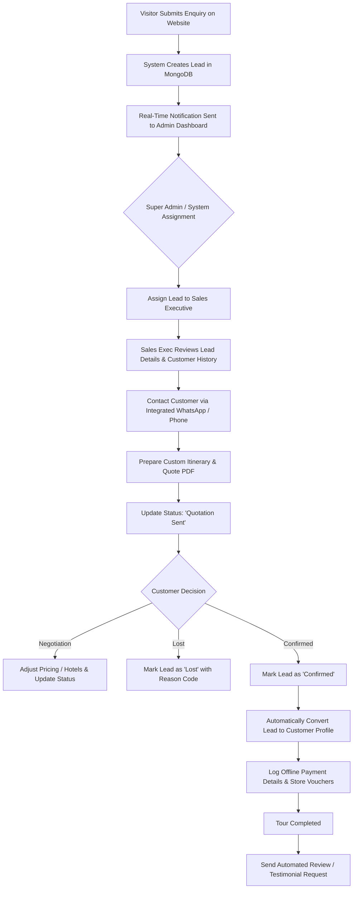

# HolidayCity - Admin Dashboard Information Architecture

**Version:** 1.0  
**Status:** Approved  
**Project Name:** HolidayCity  
**Document Type:** Back-Office Information Architecture (IA) & Systems Design  

---

## 1. Executive Summary

The **HolidayCity Admin Dashboard** is the central operational hub for the platform. Because HolidayCity operates on a **lead-driven model** without direct customer self-service logins, all customer interactions, package inventory, geographic destinations, lead conversions, content publishing, search engine optimizations, and business metrics are managed through this interface.

The interface is built to optimize travel consultant productivity, ensure zero lead leakages, streamline content publishing, and provide real-time visibility into business performance.

---

## 2. High-Level Admin Architecture Tree

```
                                      HOLIDAYCITY ADMIN DASHBOARD
                                                   │
  ┌───────────────┬───────────────┬────────────────┼───────────────┬───────────────┬───────────────┐
  │               │               │                │               │               │               │
  ▼               ▼               ▼                ▼               ▼               ▼               ▼
Dashboard     Lead Mgt        Customers       Destinations     Packages         Themes          Blogs
  │               │               │                │               │               │               │
  ├─ Revenue      ├─ New Leads    ├─ Profiles      ├─ Continents   ├─ Categories   ├─ Category Tags├─ Editor
  ├─ Pipeline     ├─ Assigned     ├─ Travel Hist.  ├─ Countries    ├─ Itineraries  └─ Icons        ├─ Tags
  └─ Quick Stats  ├─ Quotations   └─ Lifetime Val  ├─ States       ├─ Pricing                      └─ Scheduling
                  ├─ Confirmed                     ├─ Cities       └─ Hotels
                  └─ Lost                          └─ Attractions
  ┌───────────────┼───────────────┬────────────────┼───────────────┬───────────────┬───────────────┐
  │               │               │                │               │               │               │
  ▼               ▼               ▼                ▼               ▼               ▼               ▼
Gallery      Testimonials        FAQ          Newsletter      Contact Msgs     Website CMS        SEO
  │               │               │                │               │               │               │
  ├─ Photos       ├─ Video Reviews├─ Categories    ├─ Subscribers  ├─ Messages     ├─ Hero Banner  ├─ Global Meta
  └─ Videos       └─ Ratings      └─ Order         └─ CSV Export   └─ History      ├─ Promos       └─ Sitemap
  ┌───────────────┼───────────────┬────────────────┼───────────────┬───────────────┬───────────────┐
  │               │               │                │               │               │               │
  ▼               ▼               ▼                ▼               ▼               ▼               ▼
Media Library   Reports        Analytics         Users            RBAC       Notifications    Settings
  │               │               │                │               │               │               │
  ├─ Assets       ├─ Conversions  ├─ Funnel        ├─ Staff        ├─ Roles        ├─ In-App       ├─ General
  └─ Folders      └─ Export       └─ Traffic       └─ Access       └─ Matrix       └─ WhatsApp     └─ SMTP
```

---

## 3. Sidebar Navigation Taxonomy & Quick Actions

### 3.1 Primary Admin Navigation Items
1. `📊 Dashboard` (`/admin/dashboard`)
2. `🎯 Lead Management (CRM)` (`/admin/leads`)
3. `👥 Customers` (`/admin/customers`)
4. `📍 Destinations` (`/admin/destinations`)
5. `🌴 Tour Packages` (`/admin/packages`)
6. `🏷️ Travel Themes` (`/admin/themes`)
7. `📝 Blog Management` (`/admin/blogs`)
8. `🖼️ Media Gallery` (`/admin/gallery`)
9. `💬 Testimonials` (`/admin/testimonials`)
10. `❓ FAQ Management` (`/admin/faqs`)
11. `📬 Newsletter Subscribers` (`/admin/newsletter`)
12. `✉️ Contact Messages` (`/admin/contact-messages`)
13. `🖥️ Website CMS Engine` (`/admin/cms`)
14. `🔍 SEO Settings` (`/admin/seo`)
15. `📁 Media Library` (`/admin/media`)
16. `📈 Reports` (`/admin/reports`)
17. `📉 Analytics` (`/admin/analytics`)
18. `👤 User Management` (`/admin/users`)
19. `🔐 Roles & Permissions` (`/admin/roles`)
20. `🔔 Notifications` (`/admin/notifications`)
21. `📜 Audit Activity Logs` (`/admin/activity-logs`)
22. `⚙️ System Settings` (`/admin/settings`)

### 3.2 Global Quick Action Bar (Top Header)
- **Buttons:**
  - `+ Add Package`
  - `+ Add Destination`
  - `+ Add Blog`
  - `+ Upload Gallery Media`
  - `+ Create Lead Manually`
- **User Drawer:** Admin profile, active role badge, dark/light theme toggle, logout link.

---

## 4. Module Specifications

### Module 1: Dashboard & Executive Overview
- **Key Metrics Widgets:**
  - *Today's Enquiries*, *This Week's Enquiries*, *Monthly Enquiries*.
  - *Total Customers*, *Active Packages*, *Active Destinations*.
  - *Blog Count*, *Newsletter Subscribers*.
- **Offline Revenue Tracking Widget:**
  - Manual booking value logger (*Today's Sales*, *Monthly Sales*, *Annual Revenue*, *Average Package Value*).
- **Visual Lead Pipeline (Kanban Snapshot):**
  - Live count summary: `New` $\rightarrow$ `Contacted` $\rightarrow$ `Quotation Sent` $\rightarrow$ `In Negotiation` $\rightarrow$ `Confirmed` $\rightarrow$ `Completed` $\rightarrow$ `Lost`.
- **Top Performance Stats:** Most viewed package, most enquired destination, top travel theme, monthly visitor count.
- **Real-Time Activity Feed:** Event log detailing recent lead submissions, blog publishing, and user logins.

---

### Module 2: Lead Management CRM

The Lead CRM is the primary business tool for converting website traffic into revenue.

#### 2.1 Lead Sources Tracked
- Package Enquiry Form
- Destination Enquiry Form
- Contact Us Page Form
- Call Back Request Popups
- WhatsApp Direct Click-to-Chat
- Blog Embedded CTA Forms
- Homepage Search Lead Capture

#### 2.2 Lead Document Schema & Field Blueprint
- **Lead ID:** Unique string (`HC-2026-8942`).
- **Contact:** Name, Phone Number, Email Address, Preferred Contact Time.
- **Trip Parameters:** Destination, Package Interest, Travel Date, Duration, Adults, Children, Budget per Pax.
- **Workflow State:** Assigned Consultant ID, Status Badge, Priority Level (`Low`, `Medium`, `High`, `Urgent`).
- **Audit & History:** Internal Notes array, Shared PDF Quotation URLs, Communication Logs.

#### 2.3 Lead Status Lifecycle & Kanban Pipeline

```
  ┌─────────┐     ┌───────────┐     ┌───────────┐     ┌──────────────┐
  │   NEW   │ ──► │ CONTACTED │ ──► │ FOLLOW-UP │ ──► │  QUOTATION   │
  └─────────┘     └───────────┘     └───────────┘     └──────────────┘
                                                             │
  ┌─────────┐     ┌───────────┐     ┌───────────┐            ▼
  │  LOST   │ ◄── │ CANCELLED │ ◄── │ CONFIRMED │ ◄── ┌──────────────┐
  └─────────┘     └───────────┘     └───────────┘     │ NEGOTIATION  │
                                          │           └──────────────┘
                                          ▼
                                   ┌───────────┐
                                   │ COMPLETED │
                                   └───────────┘
```

#### 2.4 Lead Detail Drawer / Tabbed View
- **Tab 1: Customer & Trip Overview:** Direct call button, WhatsApp instant link, trip preferences.
- **Tab 2: Quotation Builder:** Generate itinerary link, enter custom price quote, generate downloadable PDF quote.
- **Tab 3: Communication History:** Date-stamped log of phone calls, email replies, and WhatsApp messages.
- **Tab 4: Internal Notes & Tasks:** Staff notes, set follow-up reminders with calendar notifications.

---

### Module 3: Customer Management Directory
- **Customer Profile:** Converted lead details, primary contact details, address, ID documents.
- **Travel History:** List of all previous bookings, total lifetime spend, preferred destinations.
- **Document Vault:** Secure storage for customer passports, visa copies, flight tickets, and vouchers.

---

### Module 4: Destination Management Engine

#### 4.1 Geographic Taxonomy Hierarchy
$$\text{Continent} \longrightarrow \text{Country} \longrightarrow \text{State} \longrightarrow \text{City} \longrightarrow \text{Destination Attraction}$$

#### 4.2 Destination Editor Fields
- **Basic Metadata:** Title, Slug, Category (Domestic/International), Parent Country/State.
- **Visual Media:** Banner Image, Cover Photo, Photo Gallery array.
- **Rich Content Tabs:** Overview, Best Time to Visit, Climate & Weather, Key Attractions, Things to Do, Food & Shopping Guide, Travel Advice.
- **SEO & Meta Engine:** Custom Title Tag, Meta Description, OpenGraph Image, Canonical URL override.

---

### Module 5: Tour Package Management Engine

#### 5.1 Package Attribute Specifications
- **Basic Info:** Package Title, Code (`HC-KER-001`), Slug, Category Multi-select, Theme Multi-select, Duration ($N$ Nights / $D$ Days), Active/Featured/Trending toggles.
- **Media Uploads:** Cover Image, Gallery Array, Hero Banner, Highlights Image.
- **Multi-Tier Pricing Engine:**

| Tier Name | Accommodation Level | Meal Plan | Transport Type | Price / Pax |
| :--- | :--- | :--- | :--- | :--- |
| **Standard** | 3-Star Hotels | Breakfast Only | Shared Cab / Coach | Base Price |
| **Deluxe** | 4-Star Premium Resorts | Breakfast & Dinner | Private Sedan | Base + 25% |
| **Premium** | 5-Star Luxury Stays | All Meals Included | Private SUV | Base + 55% |
| **Luxury** | Heritage / Boutique Resorts | All Meals + Snacks | Luxury SUV / Houseboat | Custom Quote |

- **Day-Wise Itinerary Builder:** Dynamic drag-and-drop form (Day Number, Title, Detailed Description, Meals Provided, Overnight Location, Photos).
- **Inclusions & Exclusions Manager:** Multi-select chips + custom text field editor.
- **Hotel Mapping:** Select from central hotel database by destination and star tier.

---

### Module 6: Travel Theme Management
- **Themes Managed:** Honeymoon, Adventure, Family, Pilgrimage, Wildlife, Luxury, Cruise, Weekend Getaway, Beach, Hill Station.
- **Fields:** Theme Name, Icon SVG, Cover Banner, Short Description, SEO Fields.

---

### Module 7: Blog & Editorial CMS
- **WYSIWYG / Markdown Editor:** Rich formatting, embedded images, dynamic package callout widgets.
- **Metadata:** Author selection, Category tags, Tags array, Cover image, Reading time calculation.
- **Publishing Control:** Draft, Published, Scheduled Date & Time.

---

### Module 8: Media Gallery Management
- Filterable visual grid supporting image and video uploads.
- Category tagging (Destination, Package, User Reviews).
- Automatic image compression (Cloudinary/S3 integration) generating WebP formats.

---

### Module 9: Testimonials & Social Proof Manager
- **Fields:** Customer Name, Traveler Photo, Rating ($1-5$ Stars), Review Text, Video YouTube/Vimeo URL, Trip Destination, Featured toggle.

---

### Module 10: FAQ Management
- Category grouping (Booking Process, Payments, Visa & Passport, Cancellation).
- Display order priority numerical input, active toggle.

---

### Module 11: Newsletter Subscribers
- Table view of email subscribers, subscription date, acquisition source page.
- Export functionality (`CSV`, `Excel`).

---

### Module 12: Contact Messages Hub
- Central inbox displaying generic website inquiries, contact form messages, feedback.
- Consultant assignment, internal response history tracking.

---

### Module 13: Website CMS Engine
- Non-technical editor for home hero banners, homepage section titles, "Why Choose Us" cards, stats counter values, partner logos, footer details, and modal popups.
- Legal Policy editor for Privacy, Terms, Cancellation, and Payment policies.

---

### Module 14: SEO Management Hub
- Global default meta tags generator.
- Page-by-page meta title and description editor.
- Auto-generated XML Sitemap status check and Robots.txt live editor.
- JSON-LD Structured Data Schema injector.

---

### Module 15: Media Library Repository
- Central storage explorer for all platform images, videos, PDFs, and vouchers.
- Multi-folder view, tag search, asset usage tracker (shows which packages use an image).

---

### Module 16: Reports Engine
- Report generators for Lead Source Performance, Top Enquired Destinations, Consultant Conversion Ratios, and Monthly Revenue Growth.
- Formats supported: PDF reports, Excel workbooks, CSV files.

---

### Module 17: Analytics Hub
- Graphical dashboards powered by GA4 & Internal logs: Visitor counts, bounce rates, popular itineraries, geographic visitor origins, lead conversion funnel.

---

## 5. User Roles & Granular Permission Matrix (RBAC)

```
                            ROLE-BASED ACCESS CONTROL
                                        │
     ┌──────────────────┬───────────────┼───────────────┬──────────────────┐
     ▼                  ▼               ▼               ▼                  ▼
Super Admin           Admin       Sales Exec      Content Mgr        Marketing Exec
(Full Access)      (Operations)   (Leads & Quotes) (CMS & Blogs)      (SEO & Newsletter)
```

### Granular Rights Matrix

| Module / Feature | Super Admin | Admin | Sales Executive | Content Manager | Marketing Executive |
| :--- | :---: | :---: | :---: | :---: | :---: |
| **Dashboard Metrics** | Full | Full | Assigned Only | Limited | Limited |
| **Lead Management** | Full (CRUD) | Full (CRUD) | View & Edit Assigned | No Access | Read Only |
| **Customer Profiles** | Full | Full | View & Edit | No Access | No Access |
| **Destinations** | Full | Full | Read Only | Full (CRUD) | Read Only |
| **Tour Packages** | Full | Full | Read Only | Full (CRUD) | Read Only |
| **Travel Themes** | Full | Full | Read Only | Full (CRUD) | Read Only |
| **Blogs & CMS** | Full | Full | No Access | Full (CRUD) | Read Only |
| **Gallery & Media** | Full | Full | No Access | Full (CRUD) | Read Only |
| **SEO Settings** | Full | Full | No Access | Edit Meta | Full (CRUD) |
| **Reports & Export**| Full | Full | Own Stats | No Access | Campaign Stats |
| **User & Role Mgt** | Full | No Access | No Access | No Access | No Access |
| **System Settings** | Full | Read Only | No Access | No Access | No Access |

---

## 6. Real-Time Notification Center

```
                        NOTIFICATION SYSTEM
                                 │
     ┌───────────────────────────┼───────────────────────────┐
     ▼                           ▼                           ▼
IN-APP NOTIFICATIONS     EMAIL ALERTS (SMTP)       WHATSAPP NOTIFICATIONS
• Toast Popups           • Sent to Consultant      • Instant Template Message
• Notification Bell      • Sent to Customer        • Follow-Up Reminder
```

### Triggers Covered
- New lead received from website.
- Lead assigned to consultant.
- Scheduled lead follow-up reminder.
- Customer contact message submitted.
- Scheduled blog published.
- Security login alert / password change.

---

## 7. Audit Activity Logs

Every sensitive operational action is logged to guarantee auditability and accountability:
- **Recorded Data:** Timestamp, User ID, User Name, IP Address, Action Type (`CREATE`, `UPDATE`, `DELETE`, `LOGIN`), Affected Module, Target Document ID, Changes Made (Diff).

---

## 8. System Settings Specifications

- **General Settings:** Company Name, Branding Logos, Favicon, Support Email, Helpline Phone.
- **Communication Config:** SMTP Credentials, Email Sender Name, WhatsApp API Credentials, Default Email Templates.
- **Website Settings:** Theme Accent Color, Maintenance Mode Toggle, Promotional Banner Toggle.
- **Security Config:** Password Expiry Policy, Session Idle Timeout, Max Failed Login Attempts.

---

## 9. End-to-End Operational Admin Workflow



---
*End of Admin Dashboard Information Architecture - HolidayCity v1.0*
