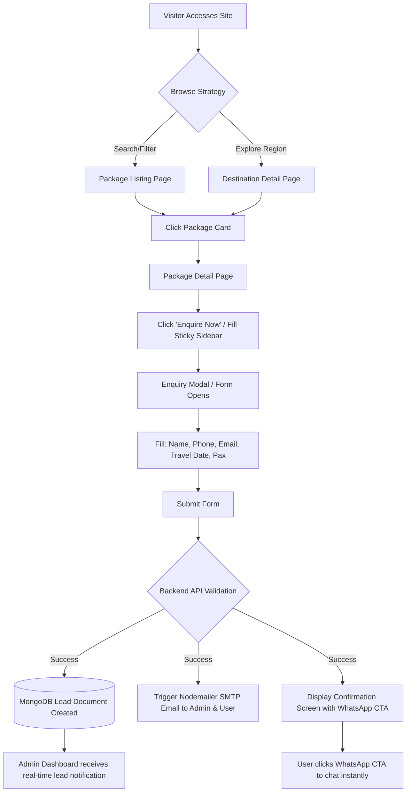

# HolidayCity - Information Architecture Specification

**Version:** 1.0  
**Status:** Approved  
**Project Name:** HolidayCity  
**Document Type:** Information Architecture (IA), Site Map & Component Design  

---

## 1. Executive Summary

This document defines the complete **Information Architecture (IA)** for the HolidayCity platform. It maps out the visual site taxonomy, page-by-page layout sequences, navigation hierarchy, dynamic routing schemas, search & filtering logic, component tree, and user flow architectures.

The site is structured to prioritize discovery, visual engagement, seamless filtering, and frictionless lead acquisition across mobile, tablet, and desktop viewports.

---

## 2. High-Level Site Taxonomy Tree

```
                                  HOLIDAYCITY WEBSITE
                                           │
  ┌──────────────┬──────────────┬──────────┼──────────┬──────────────┬──────────────┐
  │              │              │          │          │              │              │
  ▼              ▼              ▼          ▼          ▼              ▼              ▼
Home           About       Destinations Packages    Themes         Blogs         Gallery
                                │          │          │              │              │
                    ┌───────────┴┐         ├── Domestic ├── Honeymoon  ├── Listing    ├── Photos
                    │            │         ├── Intl     ├── Family     └── Details    ├── Videos
                    ▼            ▼         ├── Themes   ├── Adventure                 └── Lightbox
                Domestic       Intl        └── Custom   ├── Luxury
                    │            │                      └── Wildlife
               State/Country State/Country
                    │            │
                  City         City
                    │            │
              Destination  Destination
```

---

## 3. Public Pages Inventory & Module Summary

| Module Name | Page Type | Count / Scope | Route Path Pattern | Primary Purpose |
| :--- | :--- | :--- | :--- | :--- |
| **Home** | Static / Dynamic | 1 Page | `/` | Conversion hero, trending deals, brand authority, lead entry |
| **About Us** | Static | 1 Page | `/about` | Brand story, values, team, certifications, trust-building |
| **Destination Listing** | Directory | 2 Pages | `/destinations/domestic`, `/destinations/international` | Categorized regional breakdown of available travel locations |
| **Destination Detail** | Dynamic | Multi (Dynamic) | `/destination/:countrySlug/:stateSlug/:citySlug/:destinationSlug` | Deep dive into location attractions, weather, packages, & tips |
| **Package Directory** | Listing + Filters | 2 Pages | `/packages`, `/packages/domestic`, `/packages/international` | Main package catalog with live multi-facet filtering |
| **Package Detail** | Dynamic | Multi (Dynamic) | `/package/:packageSlug` | High-converting page with itinerary, hotel tiers, quote sidebar |
| **Travel Themes** | Listing + Detail | Dynamic | `/travel-themes`, `/theme/:themeSlug` | Persona-based package curation (Honeymoon, Luxury, Family, etc.) |
| **Blog Engine** | Listing + Detail | Dynamic | `/blogs`, `/blog/:blogSlug` | Content marketing, travel guides, SEO keyword capture |
| **Media Gallery** | Interactive | 1 Page | `/gallery` | Photo & video grid with category filters and lightbox view |
| **Testimonials** | Review Board | 1 Page | `/testimonials` | Customer reviews, video testimonials, Google Rating aggregates |
| **Contact Us** | Form + Map | 1 Page | `/contact` | Physical office locations, Google Maps, multi-channel CTAs |
| **FAQ Hub** | Accordion Grid | 1 Page | `/faq` | Organized answer repository for common booking questions |
| **Policy Pages** | Legal Content | 4 Pages | `/privacy-policy`, `/terms-and-conditions`, `/cancellation-policy`, `/payment-policy` | Legal compliance, booking terms, refund policies |
| **Sitemap** | Directory | 1 Page | `/sitemap` | Accessible visual link tree for users & search crawlers |
| **404 Page** | Error Handler | 1 Page | `/404` or `*` | Friendly fallback for non-existent routes with search box |

*Total Estimated Unique Page Views: **20–25 Core Layout Pages + Dynamic Instances**.*

---

## 4. Navigation Architecture & Global Menus

### 4.1 Navbar Specification

- **Sticky Behaviors:**
  - *Top Position (Hero Viewport):* Transparent background with white typography and high-contrast logos.
  - *Scrolled Position ($> 80\text{px}$):* Solid backdrop blur (glassmorphism/dark mode neutral) with standard shadow, persistent logo, links, and CTA button.
- **Logo:** High-resolution SVG with home navigation link.
- **Primary Menu Options:**
  1. `Home` (`/`)
  2. `Destinations` (Mega Menu dropdown: Domestic States & International Countries)
  3. `Tour Packages` (Dropdown: Domestic, International, Trending, Custom)
  4. `Travel Themes` (Icon grid dropdown)
  5. `Blogs` (`/blogs`)
  6. `Gallery` (`/gallery`)
  7. `About Us` (`/about`)
  8. `Contact` (`/contact`)
- **Primary Call to Action (CTA):** "Plan My Trip" / "Enquire Now" button triggering the Global Lead Modal.

---

## 5. Page Layout Sequences

### 5.1 Home Page Section Sequence

```
 ┌──────────────────────────────────────────────────────────┐
 │ 1. Navbar (Sticky / Glassmorphic)                        │
 ├──────────────────────────────────────────────────────────┤
 │ 2. Hero Video / High-Res Image Banner + Search Bar       │
 ├──────────────────────────────────────────────────────────┤
 │ 3. Interactive Package Search & Filter Widget            │
 ├──────────────────────────────────────────────────────────┤
 │ 4. Popular Destinations Grid (Domestic & Intl Cards)     │
 ├──────────────────────────────────────────────────────────┤
 │ 5. Travel Themes & Personas (Honeymoon, Family, etc.)    │
 ├──────────────────────────────────────────────────────────┤
 │ 6. Featured Tour Packages (Tabbed Carousel)             │
 ├──────────────────────────────────────────────────────────┤
 │ 7. Special Offers & Limited-Time Deals Banner            │
 ├──────────────────────────────────────────────────────────┤
 │ 8. Domestic Tour Highlights                              │
 ├──────────────────────────────────────────────────────────┤
 │ 9. International Tour Highlights                         │
 ├──────────────────────────────────────────────────────────┤
 │ 10. Why HolidayCity (Trust Badges & Value Props)         │
 ├──────────────────────────────────────────────────────────┤
 │ 11. Travel Process (4-Step How It Works Diagram)         │
 ├──────────────────────────────────────────────────────────┤
 │ 12. Impact & Travel Statistics Counters                  │
 ├──────────────────────────────────────────────────────────┤
 │ 13. Customer Testimonials & Video Reviews Slider         │
 ├──────────────────────────────────────────────────────────┤
 │ 14. Instagram Live Gallery Grid                          │
 ├──────────────────────────────────────────────────────────┤
 │ 15. Latest Travel Blog Snippets                          │
 ├──────────────────────────────────────────────────────────┤
 │ 16. Frequently Asked Questions (Accordion)               │
 ├──────────────────────────────────────────────────────────┤
 │ 17. Newsletter Subscription Box                          │
 ├──────────────────────────────────────────────────────────┤
 │ 18. Global Footer Structure                              │
 └──────────────────────────────────────────────────────────┘
```

### 5.2 About Page Layout
1. **Hero Banner:** Brand tagline and cover imagery.
2. **Our Story:** Founding vision, passion for travel, and customer focus.
3. **Mission & Vision:** Core operating principles.
4. **Journey Timeline:** Historical milestones from establishment to current scale.
5. **Core Values:** Transparency, customer delight, curated quality, 24/7 reliability.
6. **Meet Our Team:** Profiles of lead travel experts and founders.
7. **Achievements & Awards:** Industry recognitions and accolades.
8. **Certificates & Accreditations:** IATA, Ministry of Tourism, TAFI credentials.
9. **Travel Statistics:** Travelers served, packages crafted, customer satisfaction score.
10. **Partners:** Airline, hotel chain, and local destination partners.
11. **Bottom CTA Banner:** "Ready to explore the world with us?"
12. **Footer**

---

### 5.3 Destination Hierarchy & Page Layout

#### 5.3.1 Geographic Hierarchy Structure

```
                  GEOGRAPHIC TAXONOMY
                           │
       ┌───────────────────┴───────────────────┐
       ▼                                       ▼
  DOMESTIC (India)                       INTERNATIONAL (World)
       │                                       │
     State (e.g., Kerala)                   Country (e.g., Thailand)
       │                                       │
     City (e.g., Munnar)                     City (e.g., Phuket)
       │                                       │
  Destination Details                     Destination Details
```

#### 5.3.2 Destination Detail Page Wireframe Layout
- **Hero Header:** Parallax image background, destination name, region tags, quick trip quote CTA.
- **Overview & History:** Informative summary of the location.
- **Why Visit:** Unique selling points and highlights.
- **Best Time to Visit & Climate:** Month-by-month weather guide and peak season alerts.
- **Things to Do:** Curated list of activities (Trekking, Water sports, Cultural shows).
- **Top Sightseeing Attractions:** Card grid with photos and location details.
- **Shopping & Food Recommendations:** Local markets, souvenirs, traditional dishes.
- **Destination Photo/Video Gallery:** Multi-media lightbox grid.
- **Associated Packages:** Filtered list of active HolidayCity packages covering this destination.
- **Travel Tips & Advisory:** Visa rules, local customs, currency, language tips.
- **Destination FAQs:** Accordion of frequently asked questions.
- **Destination Quick Enquiry Form:** Sticky or embedded lead request box.

---

### 5.4 Package Listing & Package Detail Layout

#### 5.4.1 Package Card Anatomy (Listing Page Component)

```
 ┌──────────────────────────────────────────────────────────┐
 │ [Image Carousel / Cover Photo]         [Offer Badge -15%]│
 ├──────────────────────────────────────────────────────────┤
 │ Package Title (e.g., Amazing Kerala & Munnar Escape)    │
 │ ⭐ 4.9 (42 Reviews) | 📍 Kerala, India                  │
 │ ⏱️ 5 Nights / 6 Days                                      │
 ├──────────────────────────────────────────────────────────┤
 │ Quick Highlights:                                        │
 │ • Houseboat Stay • Tea Gardens • Waterfall Tour         │
 ├──────────────────────────────────────────────────────────┤
 │ Inclusions Icons: [🏨 Hotel] [🚗 Cab] [🍳 Meal] [🎟️ Sight]│
 ├──────────────────────────────────────────────────────────┤
 │ Starting Price:                                          │
 │ ₹18,500  <span style="text-decoration:line-through;">₹22,000</span> / person         │
 │                                                          │
 │  [ View Details ]          [ Enquire Now (CTA) ]        │
 └──────────────────────────────────────────────────────────┘
```

#### 5.4.2 Package Detail Page Layout (Core Conversion Hub)
1. **Hero Gallery:** Grid gallery showcasing featured property, views, and activities.
2. **Package Summary Header:** Title, Package Code, Duration (Nights/Days), Star Rating, Primary Destinations Covered.
3. **Price Card (Mobile Sticky Bottom / Desktop Floating):** Starting price, discount tag, price breakdown per pax, Enquiry CTA.
4. **Quick Facts Bar:** Stay Type, Meal Plan, Cab Type, Suitable for (Couples/Families).
5. **Key Highlights:** Bulleted bullet points of trip USPs.
6. **Day-Wise Detailed Itinerary:** Expandable/collapsible accordion specifying daily schedule, breakfast/dinner details, stay hotel.
7. **Accommodations & Hotels:** Property names, star ratings, photos, room categories included.
8. **Meals & Inclusions:** Comprehensive checklist with green checkmarks.
9. **Exclusions:** Transparent breakdown of what is not included with red cross marks.
10. **Sightseeing & Activities Details:** Descriptive section for included tours.
11. **Important Notes & Policies:** Payment terms, cancellation policies, required IDs.
12. **Package Photo Gallery:** Lightbox modal gallery.
13. **Package FAQs:** Specific trip questions.
14. **Related Packages:** Carousel of similar tours users might like.
15. **Sticky Sidebar Enquiry Form (Desktop):** Form with Date Picker, Pax Counter, Name, Phone, Email, and WhatsApp button.

---

### 5.5 Travel Themes Page
- **Curated Theme Grids:**
  - *Honeymoon Packages:* Romantic stays, candle-light dinners, private transfers.
  - *Family Getaways:* Resorts with kids activities, safe itineraries.
  - *Adventure Tours:* Trekking, rafting, camping, scuba diving.
  - *Luxury Holidays:* 5-Star luxury properties, private yachts, helicopter tours.
  - *Pilgrimage Tours:* Religious circuits, comfortable pacing.
  - *Wildlife & Safari:* National parks, jungle safaris, lodge stays.
- **Theme Detail View:** Filtered catalog pre-selected to the chosen theme with relevant hero imagery.

---

### 5.6 Blog Engine Layout

#### 5.6.1 Blog Listing Page
- **Hero Banner:** Search blog input + popular category tags.
- **Featured Post Card:** Large prominent card for top editorial story.
- **Latest Articles Grid:** 3-column card grid displaying Thumbnail, Category Tag, Title, Excerpt, Author, Date, and Read Time.
- **Sidebar Widget:** Popular articles, travel category links, package inquiry banner.
- **Pagination:** Numeric page navigator.

#### 5.6.2 Blog Detail Page
- Banner image + Category badge + Publication timestamp + Author avatar.
- Article body formatted with semantic headings, blockquotes, inline imagery, and callouts.
- Embedded Package Recommendation Cards within relevant article paragraphs.
- Social sharing sticky bar (Facebook, Twitter, WhatsApp, LinkedIn, Copy Link).
- Related articles carousel.
- Bottom lead capture modal trigger.

---

### 5.7 Media Gallery Layout
- **Filter Tabs:** All Photos, Video Walkthroughs, Domestic Destinations, International Destinations.
- **Masonry Lightbox Grid:** Responsive image layout. Clicking an item opens full-screen high-res lightbox with description and package inquiry link.

---

### 5.8 Testimonials Layout
- **Aggregate Rating Header:** Overall rating score (e.g., 4.9/5 based on 1,200+ traveler reviews).
- **Video Reviews Section:** Embedded video reels of happy customers on tour.
- **Google Reviews Integration Widget:** Live synched customer feedback badges.
- **Customer Stories Card Grid:** Detailed stories with trip photos and itinerary references.

---

### 5.9 Contact Us Page
- **Hero Header:** Direct contact hotline numbers & operational hours.
- **Interactive Contact Form:** Name, Email, Phone, Destination Interest, Travel Month, Custom Notes.
- **Office Locations Matrix:** Physical office addresses (Headquarters & Branch offices) with click-to-call links.
- **Google Maps Embed:** Interactive location pin.
- **Multi-Channel Contact Bar:** Email, Call, WhatsApp, Messenger links.

---

### 5.10 Footer Architecture

```
 ┌────────────────────────────────────────────────────────────────────────┐
 │ HOLIDAYCITY - Explore. Experience. Enjoy.                              │
 │ India's leading custom travel and holiday package curation platform.   │
 ├───────────────┬───────────────┬───────────────┬────────────────────────┤
 │ Company       │ Destinations  │ Packages      │ Support & Legal        │
 │ • About Us    │ • Domestic    │ • Family      │ • FAQ                  │
 │ • Contact Us  │ • Intl        │ • Honeymoon   │ • Privacy Policy       │
 │ • Careers     │ • Popular     │ • Adventure   │ • Terms & Conditions   │
 │ • Blog        │ • Seasonal    │ • Luxury      │ • Cancellation Policy  │
 │ • Gallery     │ • Sitemap     │ • Custom      │ • Payment Terms        │
 ├───────────────┴───────────────┴───────────────┴────────────────────────┤
 │ Newsletter Subscription:                                               │
 │ [ Enter your email address... ]               [ Subscribe Now ]       │
 ├────────────────────────────────────────────────────────────────────────┤
 │ Social Links: [FB] [IG] [YT] [LI] [WA]                                │
 │ © 2026 HolidayCity. All Rights Reserved.                               │
 └────────────────────────────────────────────────────────────────────────┘
```

---

## 6. Search Architecture & Live Auto-Suggestion Engine

The global search widget provides instant auto-suggestions as the user types across multiple query dimensions:

```
  User Query Input: "Kas..."
         │
         ▼
 ┌────────────────────────────────────────────────────────┐
 │ SUGGESTION DROPDOWN ENGINE                             │
 ├────────────────────────────────────────────────────────┤
 │ 📍 DESTINATIONS                                        │
 │   • Kashmir (State, India)                             │
 │   • Kasauli (Himachal Pradesh, India)                  │
 ├────────────────────────────────────────────────────────┤
 │ 🌴 PACKAGES                                            │
 │   • Magical Kashmir Honeymoon Special (6 Days)         │
 │   • Kashmir Budget Family Tour (5 Days)                │
 ├────────────────────────────────────────────────────────┤
 │ 🏷️ TRAVEL THEMES                                      │
 │   • Kashmir Snow & Skiing Adventures                   │
 └────────────────────────────────────────────────────────┘
```

### Search Dimensions Handled
1. **Destination Name** (State, Country, City, Region)
2. **Package Name / Package Code**
3. **Budget Range** ($< \text{₹15k}$, $\text{₹15k-₹30k}$, $> \text{₹50k}$)
4. **Duration** (Weekend 2-3 Days, 4-7 Days, Long Trip 8+ Days)
5. **Preferred Travel Month**
6. **Travel Theme / Persona**

---

## 7. Multi-Faceted Filter Matrix

### 7.1 Package Directory Filters

| Filter Dimension | Type | Filter Options / Controls |
| :--- | :--- | :--- |
| **Region** | Radio / Checkbox | Domestic, International, All |
| **Destination** | Search Select | State / Country multi-select dropdown |
| **Price Range** | Dual Range Slider | Min Price to Max Price ($\text{₹5,000} - \text{₹250,000}+$) |
| **Duration** | Checkboxes | 1-3 Nights, 4-6 Nights, 7-9 Nights, 10+ Nights |
| **Hotel Category** | Checkboxes | 3-Star Standard, 4-Star Deluxe, 5-Star Luxury, Heritage Stays |
| **Travel Theme** | Multi-select | Honeymoon, Family, Adventure, Luxury, Wildlife, Pilgrimage |
| **Inclusions** | Checkboxes | Flights Included, Meals Included, Transfers, Sightseeing, Houseboat |
| **Departure Month** | Dropdown | Jan, Feb, Mar ... Dec (Seasonal packages) |

---

## 8. End-to-End Enquiry Flow



---

## 9. Global Reusable Component Architecture

```
                                GLOBAL COMPONENTS
                                        │
     ┌──────────────────┬───────────────┼───────────────┬──────────────────┐
     ▼                  ▼               ▼               ▼                  ▼
NAVIGATION          CARDS            FORMS          FEEDBACK          MODALS & LAYOUT
├── Navbar          ├── DestCard     ├── SearchBar   ├── ToastAlert   ├── LeadModal
├── Footer          ├── PackageCard  ├── QuickEnquiry├── SkeletonLoader├── ImageLightbox
├── Breadcrumbs     ├── ReviewCard   ├── Newsletter  ├── EmptyState   ├── FilterDrawer
└── MegaMenu        ├── BlogCard     └── ContactForm └── Spinner      └── StickySidebar
```

---

## 10. Dynamic URL Taxonomy & Routing Map

| Page / Feature | Dynamic URL Route Pattern | Example SEO-Friendly URL |
| :--- | :--- | :--- |
| **Home** | `/` | `https://holidaycity.com/` |
| **About Us** | `/about` | `https://holidaycity.com/about` |
| **Destinations Landing** | `/destinations` | `https://holidaycity.com/destinations` |
| **Domestic Destinations**| `/destinations/domestic` | `https://holidaycity.com/destinations/domestic` |
| **International Dest.** | `/destinations/international` | `https://holidaycity.com/destinations/international` |
| **State Level** | `/domestic/:stateSlug` | `https://holidaycity.com/domestic/kerala` |
| **Country Level** | `/international/:countrySlug` | `https://holidaycity.com/international/thailand` |
| **City/Location Detail** | `/destination/:countrySlug/:stateSlug/:citySlug/:destinationSlug` | `https://holidaycity.com/destination/india/kerala/munnar/munnar-hills` |
| **Packages Catalog** | `/packages` | `https://holidaycity.com/packages` |
| **Domestic Packages** | `/packages/domestic` | `https://holidaycity.com/packages/domestic` |
| **International Packages**| `/packages/international` | `https://holidaycity.com/packages/international` |
| **Package Detail View** | `/package/:packageSlug` | `https://holidaycity.com/package/amazing-kerala-5-days` |
| **Themes Landing** | `/travel-themes` | `https://holidaycity.com/travel-themes` |
| **Specific Theme** | `/theme/:themeSlug` | `https://holidaycity.com/theme/honeymoon-packages` |
| **Blogs Catalog** | `/blogs` | `https://holidaycity.com/blogs` |
| **Blog Post Detail** | `/blog/:blogSlug` | `https://holidaycity.com/blog/best-time-to-visit-kashmir` |
| **Media Gallery** | `/gallery` | `https://holidaycity.com/gallery` |
| **Testimonials** | `/testimonials` | `https://holidaycity.com/testimonials` |
| **Contact Us** | `/contact` | `https://holidaycity.com/contact` |
| **FAQ Hub** | `/faq` | `https://holidaycity.com/faq` |
| **Privacy Policy** | `/privacy-policy` | `https://holidaycity.com/privacy-policy` |
| **Terms & Conditions** | `/terms-and-conditions` | `https://holidaycity.com/terms-and-conditions` |
| **Cancellation Policy** | `/cancellation-policy` | `https://holidaycity.com/cancellation-policy` |
| **Payment Policy** | `/payment-policy` | `https://holidaycity.com/payment-policy` |
| **HTML Sitemap** | `/sitemap` | `https://holidaycity.com/sitemap` |
| **404 Not Found** | `*` | `https://holidaycity.com/404` |

---
*End of Information Architecture Specification - HolidayCity v1.0*
