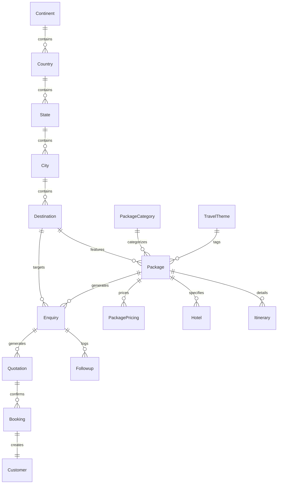

# HolidayCity - MongoDB Database Architecture Specification

**Version:** 1.0  
**Status:** Approved  
**Project Name:** HolidayCity  
**Database:** MongoDB Atlas  
**ODM:** Mongoose  
**Architecture Pattern:** Modular Collection-Based Design  
**Naming Conventions:** camelCase for fields, PascalCase for Mongoose Models, lowercase plural for collections  

---

## 1. Database Overview & Core Principles

The HolidayCity database architecture is engineered specifically to support a **lead-driven travel booking platform**. Because there is no self-service customer authentication, the database prioritizes:

1. **High-Performance Content Delivery:** Instant retrieval of complex travel packages, day-wise itineraries, and destination guides with pre-indexed multi-attribute queries.
2. **Robust CRM & Lead Pipeline:** Seamless tracking of customer enquiries, quotations, follow-ups, and booking conversions without lead data loss.
3. **Flexible CMS & Media Management:** Centralized management of dynamic homepage blocks, blogs, video/photo galleries, and promotional banners.
4. **Fine-Grained Auditability:** Soft-deletes across all business entities and audit logging for security compliance.

---

## 2. Master Collection Inventory (34 Collections)

| Module | Collection Name | Mongoose Model | Primary Purpose |
| :--- | :--- | :--- | :--- |
| **Authentication** | `users` | `User` | Admin staff & travel consultant accounts |
| | `roles` | `Role` | Role-Based Access Control (RBAC) definitions |
| | `permissions` | `Permission` | Granular action permissions per module |
| | `sessions` | `Session` | JWT refresh tokens and active admin user sessions |
| **CRM Pipeline** | `enquiries` | `Enquiry` | Core lead acquisition records from website forms |
| | `customers` | `Customer` | Verified customer records post-booking confirmation |
| | `followups` | `Followup` | Consultant follow-up logs and task schedules |
| | `quotations` | `Quotation` | Generated travel quotes, hotel options, and PDF links |
| | `bookings` | `Booking` | Confirmed travel bookings and manual payment records |
| **Travel Inventory** | `continents` | `Continent` | Top-level geographic continent classification |
| | `countries` | `Country` | Sovereign country entities with ISO codes & currency |
| | `states` | `State` | Domestic states and international provinces |
| | `cities` | `City` | Local cities and regions |
| | `destinations` | `Destination` | Primary tourist locations with attraction guides |
| | `packageCategories` | `PackageCategory` | Category taxonomy (Domestic, International, etc.) |
| | `travelThemes` | `TravelTheme` | Persona & interest tags (Honeymoon, Luxury, etc.) |
| | `packages` | `Package` | Master travel package catalog documents |
| | `itineraries` | `Itinerary` | Day-by-day schedules linked to specific packages |
| | `hotels` | `Hotel` | Property listings mapped to package tiers |
| | `packagePricing` | `PackagePricing` | Multi-tier pricing records (Standard, Deluxe, etc.) |
| **CMS Engine** | `pages` | `Page` | Editable page layouts and section structures |
| | `banners` | `Banner` | Hero banners and promotional images |
| | `homeSections` | `HomeSection` | Dynamic blocks rendered on the Homepage |
| | `blogs` | `Blog` | Travel guides, articles, and news content |
| | `blogCategories` | `BlogCategory` | Blog taxonomy tags |
| | `gallery` | `Gallery` | Photo and video media assets organized by topic |
| | `testimonials` | `Testimonial` | Customer reviews, ratings, and video stories |
| | `faqs` | `FAQ` | Frequently Asked Questions grouped by topic |
| | `newsletters` | `Newsletter` | Email subscriber directory |
| **SEO System** | `seoPages` | `SEOPage` | Page-specific meta tags, OpenGraph, and Schema markup |
| | `redirects` | `Redirect` | 301 / 302 URL redirection rules |
| **Media Library** | `mediaLibrary` | `MediaLibrary` | Media metadata repository (S3 / Cloudinary refs) |
| **Reports & Logs** | `notifications` | `Notification` | System notifications for admin staff |
| | `activityLogs` | `ActivityLog` | Security & operation audit logs |
| | `analytics` | `Analytics` | Aggregated monthly visitor and enquiry statistics |
| **Settings** | `settings` | `Setting` | Singleton document for platform configuration |

---

## 3. Standardized Audit & Soft-Delete Fields Schema

To ensure consistency, every Mongoose schema embeds the following base audit fields:

```typescript
const BaseAuditFields = {
  createdBy: { type: Schema.Types.ObjectId, ref: 'User', default: null },
  updatedBy: { type: Schema.Types.ObjectId, ref: 'User', default: null },
  isDeleted: { type: Boolean, default: false, index: true },
  deletedAt: { type: Date, default: null },
  deletedBy: { type: Schema.Types.ObjectId, ref: 'User', default: null }
};
// timestamps: true option automatically manages createdAt and updatedAt
```

---

## 4. Collection Field Schemas by Module

### 4.1 Authentication Module

#### 1. `users` Collection
```javascript
{
  _id: ObjectId,
  firstName: { type: String, required: true, trim: true },
  lastName: { type: String, required: true, trim: true },
  email: { type: String, required: true, unique: true, lowercase: true, index: true },
  mobile: { type: String, required: true },
  password: { type: String, required: true, select: false },
  role: { type: Schema.Types.ObjectId, ref: 'Role', required: true },
  department: { type: String, enum: ['Sales', 'Content', 'Marketing', 'Management', 'IT'] },
  avatar: { type: String, default: null },
  status: { type: String, enum: ['Active', 'Inactive', 'Suspended'], default: 'Active' },
  lastLogin: { type: Date, default: null },
  failedAttempts: { type: Number, default: 0 },
  accountLockedUntil: { type: Date, default: null },
  ...BaseAuditFields,
  createdAt: Date,
  updatedAt: Date
}
```

#### 2. `roles` Collection
```javascript
{
  _id: ObjectId,
  name: { type: String, required: true, unique: true }, // e.g., 'Super Admin', 'Sales Executive'
  description: { type: String },
  permissions: [{ type: Schema.Types.ObjectId, ref: 'Permission' }],
  isSystemRole: { type: Boolean, default: false },
  ...BaseAuditFields
}
```

#### 3. `permissions` Collection
```javascript
{
  _id: ObjectId,
  module: { type: String, required: true }, // e.g., 'Packages', 'Leads', 'SEO'
  action: { type: String, required: true, enum: ['View', 'Create', 'Edit', 'Delete', 'Publish', 'Export'] },
  description: { type: String }
}
```

#### 4. `sessions` Collection
```javascript
{
  _id: ObjectId,
  user: { type: Schema.Types.ObjectId, ref: 'User', required: true, index: true },
  refreshToken: { type: String, required: true },
  ip: { type: String },
  browser: { type: String },
  device: { type: String },
  expiresAt: { type: Date, required: true, index: { expires: 0 } } // TTL index for automatic expiration
}
```

---

### 4.2 CRM Module

#### 5. `enquiries` Collection (Core Lead Document)
```javascript
{
  _id: ObjectId,
  enquiryId: { type: String, required: true, unique: true, index: true }, // e.g. "HC-2026-1042"
  fullName: { type: String, required: true },
  email: { type: String, required: true, lowercase: true, index: true },
  mobile: { type: String, required: true, index: true },
  destination: { type: Schema.Types.ObjectId, ref: 'Destination', default: null },
  package: { type: Schema.Types.ObjectId, ref: 'Package', default: null },
  travelDate: { type: Date },
  adults: { type: Number, default: 1 },
  children: { type: Number, default: 0 },
  budget: { type: Number, default: null },
  travelType: { type: String, enum: ['Solo', 'Couple', 'Family', 'Friends', 'Corporate'] },
  message: { type: String },
  source: { type: String, enum: ['PackagePage', 'DestinationPage', 'ContactForm', 'WhatsApp', 'CallRequest', 'PopupModal'], default: 'PackagePage' },
  status: { type: String, enum: ['New', 'Contacted', 'FollowupPending', 'QuotationSent', 'Negotiation', 'Confirmed', 'Cancelled', 'Lost', 'Completed'], default: 'New', index: true },
  assignedTo: { type: Schema.Types.ObjectId, ref: 'User', default: null, index: true },
  priority: { type: String, enum: ['Low', 'Medium', 'High', 'Urgent'], default: 'Medium' },
  followupDate: { type: Date, default: null },
  notes: [{
    note: String,
    createdBy: { type: Schema.Types.ObjectId, ref: 'User' },
    createdAt: { type: Date, default: Date.now }
  }],
  ...BaseAuditFields,
  createdAt: Date,
  updatedAt: Date
}
```

#### 6. `customers` Collection
```javascript
{
  _id: ObjectId,
  enquiry: { type: Schema.Types.ObjectId, ref: 'Enquiry', required: true },
  customerCode: { type: String, required: true, unique: true }, // e.g. "CUST-9021"
  fullName: { type: String, required: true },
  email: { type: String, required: true, lowercase: true },
  mobile: { type: String, required: true },
  dob: { type: Date },
  address: {
    street: String,
    city: String,
    state: String,
    zipCode: String,
    country: String
  },
  passportNumber: { type: String, default: null },
  preferredDestinations: [{ type: Schema.Types.ObjectId, ref: 'Destination' }],
  notes: { type: String },
  ...BaseAuditFields
}
```

#### 7. `followups` Collection
```javascript
{
  _id: ObjectId,
  enquiry: { type: Schema.Types.ObjectId, ref: 'Enquiry', required: true, index: true },
  executive: { type: Schema.Types.ObjectId, ref: 'User', required: true },
  followupDate: { type: Date, required: true },
  remarks: { type: String, required: true },
  nextFollowup: { type: Date, default: null },
  status: { type: String, enum: ['Pending', 'Completed', 'Rescheduled', 'Missed'], default: 'Pending' },
  ...BaseAuditFields
}
```

#### 8. `quotations` Collection
```javascript
{
  _id: ObjectId,
  enquiry: { type: Schema.Types.ObjectId, ref: 'Enquiry', required: true, index: true },
  quotationNumber: { type: String, required: true, unique: true }, // e.g. "QT-2026-041"
  package: { type: Schema.Types.ObjectId, ref: 'Package', required: true },
  hotelCategory: { type: String, enum: ['Standard', 'Deluxe', 'Premium', 'Luxury'] },
  transportDetails: { type: String },
  amount: { type: Number, required: true },
  pdfUrl: { type: String, required: true },
  status: { type: String, enum: ['Draft', 'Sent', 'Accepted', 'Rejected', 'Expired'], default: 'Sent' },
  ...BaseAuditFields
}
```

#### 9. `bookings` Collection
```javascript
{
  _id: ObjectId,
  enquiry: { type: Schema.Types.ObjectId, ref: 'Enquiry', required: true },
  quotation: { type: Schema.Types.ObjectId, ref: 'Quotation', required: true },
  bookingNumber: { type: String, required: true, unique: true }, // e.g. "BK-2026-781"
  travelDate: { type: Date, required: true },
  totalAmount: { type: Number, required: true },
  bookingStatus: { type: String, enum: ['Upcoming', 'InProgress', 'Completed', 'Cancelled'], default: 'Upcoming' },
  remarks: { type: String },
  ...BaseAuditFields
}
```

---

### 4.3 Travel Inventory Module

#### 10. `continents` Collection
```javascript
{
  _id: ObjectId,
  name: { type: String, required: true, unique: true },
  slug: { type: String, required: true, unique: true },
  image: { type: String },
  displayOrder: { type: Number, default: 0 },
  status: { type: String, enum: ['Active', 'Inactive'], default: 'Active' }
}
```

#### 11. `countries` Collection
```javascript
{
  _id: ObjectId,
  continent: { type: Schema.Types.ObjectId, ref: 'Continent', required: true },
  name: { type: String, required: true },
  slug: { type: String, required: true, unique: true, index: true },
  image: { type: String },
  isoCode: { type: String, required: true, uppercase: true }, // e.g. "IN", "TH"
  currency: { type: String, default: 'INR' },
  timezone: { type: String },
  seo: {
    metaTitle: String,
    metaDescription: String,
    keywords: [String]
  },
  status: { type: String, enum: ['Active', 'Inactive'], default: 'Active' }
}
```

#### 12. `states` Collection
```javascript
{
  _id: ObjectId,
  country: { type: Schema.Types.ObjectId, ref: 'Country', required: true, index: true },
  name: { type: String, required: true },
  slug: { type: String, required: true, unique: true, index: true },
  image: { type: String },
  seo: {
    metaTitle: String,
    metaDescription: String
  }
}
```

#### 13. `cities` Collection
```javascript
{
  _id: ObjectId,
  state: { type: Schema.Types.ObjectId, ref: 'State', required: true, index: true },
  name: { type: String, required: true },
  slug: { type: String, required: true, index: true },
  image: { type: String }
}
```

#### 14. `destinations` Collection
```javascript
{
  _id: ObjectId,
  country: { type: Schema.Types.ObjectId, ref: 'Country', required: true },
  state: { type: Schema.Types.ObjectId, ref: 'State', required: true },
  city: { type: Schema.Types.ObjectId, ref: 'City', default: null },
  name: { type: String, required: true },
  slug: { type: String, required: true, unique: true, index: true },
  banner: { type: String, required: true },
  gallery: [{ type: String }],
  shortDescription: { type: String },
  overview: { type: String },
  bestTime: { type: String },
  weather: { type: String },
  food: { type: String },
  shopping: { type: String },
  travelTips: { type: String },
  activities: [{ type: String }],
  attractions: [{
    name: String,
    description: String,
    image: String
  }],
  faq: [{
    question: String,
    answer: String
  }],
  seo: {
    metaTitle: String,
    metaDescription: String,
    keywords: [String]
  },
  featured: { type: Boolean, default: false, index: true },
  status: { type: String, enum: ['Active', 'Inactive'], default: 'Active', index: true },
  ...BaseAuditFields
}
```

#### 15. `packageCategories` Collection
```javascript
{
  _id: ObjectId,
  name: { type: String, required: true, unique: true }, // e.g. "Domestic", "International"
  slug: { type: String, required: true, unique: true },
  icon: { type: String },
  banner: { type: String }
}
```

#### 16. `travelThemes` Collection
```javascript
{
  _id: ObjectId,
  name: { type: String, required: true, unique: true }, // e.g. "Honeymoon", "Family"
  slug: { type: String, required: true, unique: true, index: true },
  icon: { type: String },
  description: { type: String },
  banner: { type: String }
}
```

#### 17. `packages` Collection (Master Tour Document)
```javascript
{
  _id: ObjectId,
  packageCode: { type: String, required: true, unique: true, index: true }, // e.g. "PKG-KER-001"
  title: { type: String, required: true },
  slug: { type: String, required: true, unique: true, index: true },
  destination: { type: Schema.Types.ObjectId, ref: 'Destination', required: true, index: true },
  category: [{ type: Schema.Types.ObjectId, ref: 'PackageCategory' }],
  theme: [{ type: Schema.Types.ObjectId, ref: 'TravelTheme', index: true }],
  duration: {
    nights: { type: Number, required: true },
    days: { type: Number, required: true }
  },
  startingPrice: { type: Number, required: true, index: true },
  discountPrice: { type: Number, default: null },
  coverImage: { type: String, required: true },
  gallery: [{ type: String }],
  rating: { type: Number, default: 4.8 },
  overview: { type: String },
  highlights: [{ type: String }],
  inclusions: [{ type: String }],
  exclusions: [{ type: String }],
  transport: { type: String },
  meals: { type: String },
  activities: [{ type: String }],
  pickup: { type: String },
  drop: { type: String },
  featured: { type: Boolean, default: false, index: true },
  trending: { type: Boolean, default: false, index: true },
  popular: { type: Boolean, default: false },
  seo: {
    metaTitle: String,
    metaDescription: String,
    keywords: [String]
  },
  status: { type: String, enum: ['Active', 'Draft', 'Inactive'], default: 'Active', index: true },
  ...BaseAuditFields
}
```

#### 18. `itineraries` Collection
```javascript
{
  _id: ObjectId,
  package: { type: Schema.Types.ObjectId, ref: 'Package', required: true, index: true },
  day: { type: Number, required: true },
  title: { type: String, required: true },
  description: { type: String, required: true },
  hotel: { type: String },
  meal: [{ type: String, enum: ['Breakfast', 'Lunch', 'Dinner'] }],
  activities: [{ type: String }]
}
```

#### 19. `hotels` Collection
```javascript
{
  _id: ObjectId,
  package: { type: Schema.Types.ObjectId, ref: 'Package', required: true, index: true },
  name: { type: String, required: true },
  rating: { type: Number, enum: [3, 4, 5], required: true },
  roomType: { type: String },
  amenities: [{ type: String }],
  images: [{ type: String }]
}
```

#### 20. `packagePricing` Collection
```javascript
{
  _id: ObjectId,
  package: { type: Schema.Types.ObjectId, ref: 'Package', required: true, index: true },
  category: { type: String, enum: ['Standard', 'Deluxe', 'Premium', 'Luxury'], required: true },
  price: { type: Number, required: true },
  discount: { type: Number, default: 0 },
  hotel: { type: String },
  meal: { type: String },
  transport: { type: String },
  availability: { type: Boolean, default: true }
}
```

---

### 4.4 CMS Module

#### 21. `pages` Collection
```javascript
{
  _id: ObjectId,
  page: { type: String, required: true, unique: true }, // e.g. "home", "about"
  sections: { type: Schema.Types.Mixed },
  seo: {
    metaTitle: String,
    metaDescription: String
  }
}
```

#### 22. `banners` Collection
```javascript
{
  _id: ObjectId,
  page: { type: String, required: true },
  desktopImage: { type: String, required: true },
  mobileImage: { type: String, required: true },
  title: { type: String },
  subtitle: { type: String },
  buttonText: { type: String },
  buttonLink: { type: String },
  active: { type: Boolean, default: true }
}
```

#### 23. `homeSections` Collection
```javascript
{
  _id: ObjectId,
  sectionKey: { type: String, required: true, unique: true }, // e.g., 'popularDestinations', 'trendingPackages'
  title: { type: String },
  subtitle: { type: String },
  displayOrder: { type: Number, default: 0 },
  active: { type: Boolean, default: true }
}
```

#### 24. `blogs` Collection
```javascript
{
  _id: ObjectId,
  title: { type: String, required: true },
  slug: { type: String, required: true, unique: true, index: true },
  category: { type: Schema.Types.ObjectId, ref: 'BlogCategory', required: true, index: true },
  author: { type: String, required: true },
  banner: { type: String, required: true },
  content: { type: String, required: true }, // Rich HTML/Markdown
  tags: [{ type: String }],
  views: { type: Number, default: 0 },
  featured: { type: Boolean, default: false, index: true },
  seo: {
    metaTitle: String,
    metaDescription: String,
    keywords: [String]
  },
  status: { type: String, enum: ['Draft', 'Published'], default: 'Published' },
  ...BaseAuditFields,
  createdAt: Date
}
```

#### 25. `blogCategories` Collection
```javascript
{
  _id: ObjectId,
  name: { type: String, required: true, unique: true },
  slug: { type: String, required: true, unique: true }
}
```

#### 26. `gallery` Collection
```javascript
{
  _id: ObjectId,
  type: { type: String, enum: ['Photo', 'Video'], default: 'Photo' },
  destination: { type: Schema.Types.ObjectId, ref: 'Destination', default: null },
  package: { type: Schema.Types.ObjectId, ref: 'Package', default: null },
  images: [{ type: String }],
  videos: [{ type: String }],
  ...BaseAuditFields
}
```

#### 27. `testimonials` Collection
```javascript
{
  _id: ObjectId,
  customerName: { type: String, required: true },
  customerPhoto: { type: String },
  destination: { type: Schema.Types.ObjectId, ref: 'Destination' },
  rating: { type: Number, min: 1, max: 5, default: 5 },
  review: { type: String, required: true },
  videoUrl: { type: String, default: null },
  featured: { type: Boolean, default: false },
  ...BaseAuditFields
}
```

#### 28. `faqs` Collection
```javascript
{
  _id: ObjectId,
  category: { type: String, enum: ['General', 'Booking', 'Visa', 'Payment', 'Cancellation'], default: 'General' },
  question: { type: String, required: true },
  answer: { type: String, required: true },
  displayOrder: { type: Number, default: 0 },
  active: { type: Boolean, default: true }
}
```

#### 29. `newsletters` Collection
```javascript
{
  _id: ObjectId,
  email: { type: String, required: true, unique: true, lowercase: true },
  subscribedAt: { type: Date, default: Date.now }
}
```

---

### 4.5 SEO, Media, Reports & Settings Modules

#### 30. `seoPages` Collection
```javascript
{
  _id: ObjectId,
  pageIdentifier: { type: String, required: true, unique: true }, // e.g., '/packages/domestic'
  metaTitle: { type: String, required: true },
  metaDescription: { type: String, required: true },
  keywords: [{ type: String }],
  canonical: { type: String },
  schemaMarkup: { type: Schema.Types.Mixed }, // JSON-LD schema payload
  ogImage: { type: String }
}
```

#### 31. `redirects` Collection
```javascript
{
  _id: ObjectId,
  oldUrl: { type: String, required: true, unique: true },
  newUrl: { type: String, required: true },
  statusCode: { type: Number, enum: [301, 302], default: 301 }
}
```

#### 32. `mediaLibrary` Collection
```javascript
{
  _id: ObjectId,
  publicId: { type: String, required: true, unique: true }, // Cloudinary / S3 Key
  fileName: { type: String, required: true },
  url: { type: String, required: true },
  folder: { type: String, default: 'general' },
  size: { type: Number },
  mimeType: { type: String },
  dimensions: {
    width: Number,
    height: Number
  },
  uploadedBy: { type: Schema.Types.ObjectId, ref: 'User' },
  uploadedAt: { type: Date, default: Date.now }
}
```

#### 33. `notifications` Collection
```javascript
{
  _id: ObjectId,
  title: { type: String, required: true },
  message: { type: String, required: true },
  user: { type: Schema.Types.ObjectId, ref: 'User', required: true, index: true },
  type: { type: String, enum: ['Enquiry', 'Followup', 'System', 'Alert'], default: 'Enquiry' },
  read: { type: Boolean, default: false, index: true },
  createdAt: { type: Date, default: Date.now }
}
```

#### 34. `activityLogs` Collection
```javascript
{
  _id: ObjectId,
  user: { type: Schema.Types.ObjectId, ref: 'User', required: true },
  module: { type: String, required: true },
  action: { type: String, required: true }, // e.g. "CREATE_PACKAGE", "UPDATE_LEAD"
  recordId: { type: Schema.Types.ObjectId, default: null },
  ip: { type: String },
  browser: { type: String },
  timestamp: { type: Date, default: Date.now, index: true }
}
```

#### 35. `analytics` Collection
```javascript
{
  _id: ObjectId,
  page: { type: String, required: true },
  views: { type: Number, default: 0 },
  uniqueVisitors: { type: Number, default: 0 },
  enquiries: { type: Number, default: 0 },
  month: { type: String, required: true } // e.g., "2026-07"
}
```

#### 36. `settings` Collection (Singleton Document)
```javascript
{
  _id: ObjectId,
  companyName: { type: String, default: 'HolidayCity' },
  logo: { type: String },
  favicon: { type: String },
  emails: {
    primary: String,
    support: String
  },
  phones: {
    primary: String,
    whatsapp: String
  },
  address: { type: String },
  socialLinks: {
    facebook: String,
    instagram: String,
    youtube: String,
    linkedin: String
  },
  smtp: {
    host: String,
    port: Number,
    user: String,
    secure: Boolean
  },
  seoDefaults: {
    metaTitle: String,
    metaDescription: String
  },
  theme: {
    primaryColor: String,
    secondaryColor: String
  },
  maintenanceMode: { type: Boolean, default: false }
}
```

---

## 5. Collection Relationships Diagram



---

## 6. Performance Indexing Strategy

### 6.1 Critical Compound & Single Indexes

```javascript
// Packages Collection Indexes
packagesSchema.index({ slug: 1 });
packagesSchema.index({ destination: 1, status: 1 });
packagesSchema.index({ category: 1, status: 1 });
packagesSchema.index({ theme: 1, featured: -1 });
packagesSchema.index({ startingPrice: 1 });
packagesSchema.index({ status: 1, isDeleted: 1 });

// Destinations Collection Indexes
destinationsSchema.index({ slug: 1 });
destinationsSchema.index({ country: 1, state: 1, status: 1 });
destinationsSchema.index({ featured: -1, status: 1 });

// Enquiries Collection Indexes (CRM Performance)
enquiriesSchema.index({ status: 1, createdAt: -1 });
enquiriesSchema.index({ assignedTo: 1, status: 1 });
enquiriesSchema.index({ mobile: 1, email: 1 });
enquiriesSchema.index({ travelDate: 1 });

// Blogs Collection Indexes
blogsSchema.index({ slug: 1 });
blogsSchema.index({ category: 1, status: 1, createdAt: -1 });
```

---

## 7. MongoDB Operational Best Practices

1. **ACID Transactions:** Use Mongoose Sessions & Multi-document Transactions when converting an Enquiry into a Booking and initializing a Customer record.
2. **Readable Entity Identifiers:** Enforce human-readable codes (`HC-2026-XXXX` for leads, `PKG-XXXX` for packages, `BK-XXXX` for bookings) alongside default Mongoose `_id`.
3. **Soft Delete Enforcement:** Apply Mongoose query middleware to filter `{ isDeleted: false }` by default across all `find()` operations.
4. **Media Storage:** Store only cloud metadata (`publicId`, `url`, dimensions) in MongoDB; offload physical file storage to Cloudinary / AWS S3.
5. **Aggregation Pipelines:** Use aggregation pipelines for Admin Dashboard stats rather than storing duplicate metric counts.

---
*End of MongoDB Database Architecture - HolidayCity v1.0*
