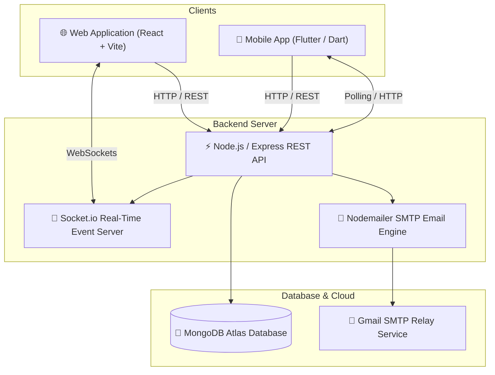

# 🏖️ HolidayCity — Tour & Travel Management System
## Full-Stack Web Application, Admin Back-Office & Flutter Mobile Application

---

## 📌 Executive Summary

**HolidayCity** is a premium, full-stack tour package booking, lead management, and direct customer support platform. It empowers travelers to browse curated tour packages, request custom trip quotes, manage bookings, pay advance/remaining balances, and engage in **real-time direct chat support** with travel administrators across both Web and Mobile devices.

---

## 🛠️ Technology Stack & Architecture

| Layer | Technologies & Frameworks |
| :--- | :--- |
| **Frontend Web** | React 18, TypeScript, Vite, TailwindCSS, Lucide Icons, Axios, React Router v6 |
| **Mobile App** | Flutter 3.x, Dart, Provider State Management, Google Fonts |
| **Backend API** | Node.js, Express.js, TypeScript, Socket.io (WebSockets), Nodemailer |
| **Database** | MongoDB Atlas, Mongoose ODM, LRU In-Memory Cache |
| **Email Service** | Gmail SMTP (`naveenkumar970100@gmail.com`) with high-contrast HTML templates |

---

## 🏗️ System Architecture



---

## ✨ Key Platform Features

### 1. 💬 Real-Time Direct Support Chat
* **Topic-Based Threading**: Chat conversations are linked to specific reference IDs e.g. `BK-2026-1004` (Bookings) or `HC-2026-1001` (Enquiries).
* **Cross-Platform Availability**:
  * **Web**: [ChatModal.tsx](file:///c:/Users/Lenovo/OneDrive/Desktop/tour/client/src/components/chat/ChatModal.tsx) opens directly from "Chat with Admin" buttons on booking and enquiry cards.
  * **Mobile**: [chat_bottom_sheet.dart](file:///c:/Users/Lenovo/OneDrive/Desktop/tour/mobile/lib/views/chat/chat_bottom_sheet.dart) provides a native Flutter bottom sheet for live messaging.
* **Admin Support Messages Inbox**: 2-pane inbox in [AdminMessagesPage.tsx](file:///c:/Users/Lenovo/OneDrive/Desktop/tour/client/src/admin/pages/AdminMessagesPage.tsx) with search, topic filtering, unread badges, and real-time message composer.
* **Offline Email Alerts**: Automatically notifies travelers via Gmail when an admin replies while the user is offline.

### 2. 📧 Gmail SMTP HTML Email Notifications
Configured via Nodemailer with mobile-responsive, high-contrast HTML templates:
* **Booking Confirmation Email**: Sent automatically upon booking placement.
* **Booking Status Update Email**: Sent when status changes e.g. `Confirmed`, `Advance Paid`, `Fully Paid`.
* **Payment Receipt Email**: Sent upon receipt of advance or balance payments.
* **Enquiry Confirmation & Status Update Emails**: Sent when new custom quotes are requested or updated.
* **Chat Reply Email**: Sent when admin sends a message to an offline traveler.

### 3. 🛡️ Executive Admin Dashboard
* **Executive Overview**: Financial analytics, booking metrics, lead pipeline conversion graphs.
* **Bookings Manager**: Financial breakdown, advance payment approvals, status updates.
* **Lead CRM (Enquiries)**: Custom quote builder, customer follow-up status tracking.
* **Package & Destination Manager**: Full CRUD management of tour packages and destinations.
* **Support Messages Inbox**: Positioned at the bottom of the admin sidebar menu for easy access.

---

## 🗄️ Database Schemas

### `ChatMessage` Schema ([ChatMessage.ts](file:///c:/Users/Lenovo/OneDrive/Desktop/tour/server/src/models/ChatMessage.ts))
```typescript
interface IChatMessage {
  topicId: string;       // e.g. "BK-2026-1004" or "HC-2026-1001"
  topicType: string;     // 'Booking' | 'Enquiry' | 'General'
  topicTitle?: string;   // Package or Destination name
  senderType: string;    // 'User' | 'Admin'
  senderId?: string;
  senderName: string;    // Customer Name or 'HolidayCity Support'
  senderEmail: string;   // Customer Email
  message: string;       // Chat content
  attachments?: string[];
  isReadByAdmin: boolean;
  isReadByUser: boolean;
  createdAt: Date;
  updatedAt: Date;
}
```

---

## 📡 REST API Directory

| Method | Endpoint | Access | Description |
| :--- | :--- | :--- | :--- |
| `GET` | `/api/v1/packages` | Public | Fetch published tour packages |
| `GET` | `/api/v1/destinations` | Public | Fetch active destinations |
| `POST` | `/api/v1/bookings` | Public/User | Create a new package booking |
| `GET` | `/api/v1/bookings/my` | User | Fetch user's bookings |
| `POST` | `/api/v1/enquiries` | Public/User | Submit a custom tour enquiry |
| `GET` | `/api/v1/enquiries/my` | User | Fetch user's enquiries |
| `POST` | `/api/v1/chat/messages` | Public/User | Send a chat message |
| `GET` | `/api/v1/chat/messages/:topicId` | Public/User | Fetch message history for a topic |
| `GET` | `/api/v1/chat/conversations` | Public/Admin | Fetch all chat conversation threads |
| `PATCH` | `/api/v1/chat/read/:topicId` | Public/User | Mark conversation thread as read |
| `GET` | `/api/v1/admin/bookings` | Admin | Manage all platform bookings |
| `GET` | `/api/v1/admin/enquiries` | Admin | Manage lead CRM enquiries |

---

## 🚀 Environment Setup & Run Instructions

### 1. Server Configuration (`server/.env`)
```env
PORT=5000
MONGODB_URI=mongodb+srv://...
JWT_SECRET=your_jwt_secret
SMTP_HOST=smtp.gmail.com
SMTP_PORT=587
SMTP_USER=naveenkumar970100@gmail.com
SMTP_PASS=cxycnmgobebxpyys
EMAIL_FROM=HolidayCity Support <naveenkumar970100@gmail.com>
```

### 2. Running Locally

#### Start Express Backend API Server:
```bash
cd server
npm start
```

#### Start React Web Frontend:
```bash
cd client
npm run dev
```

#### Run Flutter Mobile App:
```bash
cd mobile
flutter run
```
