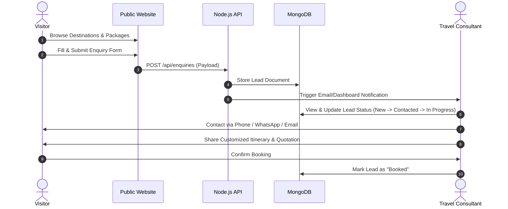

# HolidayCity - Product Requirements Document (PRD)

**Version:** 1.0  
**Status:** Approved / Specification Ready  
**Project Name:** HolidayCity  
**Project Type:** Travel & Tourism Booking Platform (Lead Generation Model)  
**Company:** HolidayCity  
**Tagline:** *Explore. Experience. Enjoy.*  

---

## Document Metadata

| Item | Details |
| :--- | :--- |
| **Product Name** | HolidayCity |
| **Product Type** | Travel Booking & Lead Management Platform |
| **Frontend** | React.js + Vite + TypeScript + Tailwind CSS |
| **Backend** | Node.js + Express.js (RESTful API Architecture) |
| **Database** | MongoDB + Mongoose ODM |
| **Authentication** | JWT (JSON Web Tokens) + Secure HTTP-Only Refresh Tokens |
| **Media Storage** | Cloudinary / AWS S3 |
| **Maps Integration** | Google Maps JavaScript API / Embed API |
| **Email Service** | Nodemailer SMTP (Transactional Notifications) |
| **Messaging** | WhatsApp Click-to-Chat Integration |
| **Hosting & Infra** | AWS EC2 + Nginx Reverse Proxy |
| **Content Delivery** | AWS CloudFront CDN |
| **Analytics** | Google Analytics 4 (GA4) |
| **SEO** | Advanced Dynamic Meta Tags, Structured Data (Schema.org), Dynamic Sitemap, OpenGraph |

---

## 1. Executive Summary

**HolidayCity** is a modern, high-performance travel platform designed to enable users to discover domestic and international travel destinations, explore hand-crafted holiday packages, submit detailed travel enquiries, and connect directly with travel experts.

Unlike traditional self-service booking engines that require upfront payments and instant booking, HolidayCity operates as a high-conversion **travel lead generation engine**. Visitors browse rich content (destinations, packages, itineraries, blogs, gallery), submit customized trip enquiries, and HolidayCity’s travel consultants manage and convert these leads into confirmed bookings via an integrated Admin Dashboard.

The platform combines a world-class customer-facing UX with modern web standards, optimized performance, dynamic SEO capabilities, and a feature-rich back-office management system for travel operators.

---

## 2. Vision

To become one of India's most trusted and premium travel platforms by seamlessly pairing technology-driven travel discovery with personalized human consulting, delivering unforgettable holiday experiences across global destinations.

---

## 3. Mission

1. **Simplify Travel Planning:** Offer intuitive exploration across curated destinations, themes, and itineraries.
2. **Personalized Recommendations:** Provide custom-tailored holiday packages based on traveler personas and budgets.
3. **Memorable Service:** Connect travelers with experienced holiday consultants via rapid multi-channel communication (Call, Email, WhatsApp).
4. **Operational Efficiency:** Empower travel operations teams with a centralized lead, package, and content management pipeline.
5. **Digital Brand Leadership:** Drive organic traffic growth through semantic, SEO-first architecture and performance optimization.

---

## 4. Business Objectives

### Primary Objectives
- **Lead Generation:** Maximize qualified travel enquiries from high-intent visitors.
- **Conversion Efficiency:** Improve enquiry-to-booking conversion rate through rapid response tools and centralized lead management.
- **Brand Authority:** Establish HolidayCity as a premium travel brand for domestic and international holidays.
- **Organic Growth:** Capture top search engine rankings for key travel queries (e.g., *"Honeymoon packages in Bali"*, *"Kashmir group tours"*).
- **Centralized Administration:** Enable non-technical team members to manage packages, destinations, blogs, and media effortlessly.

### Secondary Objectives
- Enhance visitor engagement time with rich galleries, dynamic itineraries, and interactive maps.
- Build customer loyalty leading to repeat enquiries and referrals.
- Streamline lead assignment, follow-ups, and lead status tracking for travel consultants.
- Provide actionable analytics and reports for business growth strategy.

---

## 5. Target Audience & Personas

| Persona Category | Characteristics & Needs | Key Offerings / Focus |
| :--- | :--- | :--- |
| **Families** | Vacation planning, safety, child-friendly activities, multi-generation comfort | Family packages, resort stays, leisure itineraries, all-inclusive options |
| **Couples** | Honeymooners, romantic getaways, anniversary celebrations, privacy | Private transfers, luxury resorts, romantic dinners, beach/hill getaways |
| **Solo Travelers** | Backpacking, cultural immersion, adventure, flexible itineraries | Guided group tours, trek packages, budget stay options |
| **Corporate Clients** | MICE (Meetings, Incentives, Conferences, Exhibitions), team outings | Bulk bookings, custom corporate itineraries, invoice & quote support |
| **Senior Citizens** | Leisure tours, pilgrimage trips, comfortable pace, accessible travel | Guided tours, medical accessibility, relaxed itineraries, group departures |
| **Students** | Educational trips, budget group departures, adventurous experiences | Affordable packages, group discounts, institutional billing support |

---

## 6. Business Model & Workflow

### 6.1 Lead Flow Architecture



### 6.2 Revenue Sources
- **Domestic Tour Packages:** Complete land packages (Hotels + Transfers + Sightseeing).
- **International Tour Packages:** Outbound travel packages for popular global destinations.
- **Customized Holiday Packages:** High-margin tailored itineraries for luxury/corporate clients.
- **Group Departures:** Fixed-date group tours with optimized per-pax margins.
- **Add-On Travel Services:** Visa processing assistance, travel insurance, flight/hotel concierge services.

---

## 7. User Roles & Access Control

### 7.1 Visitor (Public User)
- **Permissions:** Unauthenticated read access to public content; write access for submitting enquiries, newsletter subscriptions, and feedback.
- **Key Actions:**
  - Search and filter destinations and holiday packages.
  - View full package details (Itinerary, Inclusions/Exclusions, Hotel details, Photos).
  - Submit quick or detailed enquiry forms.
  - Trigger "Click-to-Chat" via WhatsApp or "Click-to-Call".
  - Read travel blogs, customer testimonials, and FAQs.

### 7.2 Admin / Travel Consultant
- **Permissions:** Authenticated access via JWT with Role-Based Access Control (Super Admin, Travel Consultant, Content Manager).
- **Key Actions:**
  - Full CRUD operations on Packages, Destinations, Blogs, Testimonials, FAQs, and CMS pages.
  - Comprehensive Lead Management (Status changes, follow-up notes, consultant assignment).
  - Access platform analytics, audit logs, and performance reports.
  - Manage media gallery and image optimization settings.

---

## 8. Product Scope

```
                             HOLIDAYCITY PLATFORM
                                       │
            ┌──────────────────────────┴──────────────────────────┐
            ▼                                                     ▼
     PUBLIC WEBSITE                                        ADMIN DASHBOARD
  ├── Home Page                                         ├── Overview & Analytics
  ├── Destinations (Domestic/Intl)                      ├── Lead Management Pipeline
  ├── Package Directory & Details                       ├── Package Management (CRUD)
  ├── Interactive Search & Filters                      ├── Destination Management (CRUD)
  ├── Travel Blog & Stories                             ├── Blog & CMS Engine
  ├── Media Gallery & Testimonials                      ├── Customer Enquiries Database
  ├── Contact Us & Google Maps Integration              ├── Testimonials & FAQ Manager
  └── Inquiry & Lead Capture Modals                     └── User Roles & System Settings
```

### 8.1 In Scope (Phase 1)
- Complete Public Website (Responsive React + Tailwind CSS).
- Dynamic Destination & Package rendering engine.
- Multi-step Lead Capture Forms (Global, Package-specific, Destination-specific).
- Admin Dashboard with Lead Pipeline Management.
- Package & Destination CMS with rich content fields (Day-wise itinerary, inclusions, exclusions, hotel tiers, price tags).
- Blog Engine with markdown/rich-text editor and SEO meta controls.
- Media Library integrated with Cloudinary/S3.
- Advanced SEO tags, Schema.org structured data, and auto-generated XML Sitemap.
- Automated Email Notifications for new enquiries.

### 8.2 Out of Scope (Phase 1 - Deferred to Phase 2)
- Customer registration / self-service login portal.
- Online payment gateway integration (Razorpay/Stripe).
- Instant self-booking and real-time inventory locking.
- Customer-facing mobile applications (iOS / Android).
- B2B Multi-vendor / Travel Agent marketplace.
- Automated dynamic flight search API.

---

## 9. Functional Requirements

### 9.1 Public Website

#### 9.1.1 Header & Navigation
- **Sticky Navbar:** Smooth blur/shadow effect on scroll with logo, primary navigation links, contact CTA, and mobile hamburger menu.
- **Mega Menu:** Categorized hover menu displaying popular Domestic and International destinations with images.
- **Search Bar:** Global autocomplete search for destinations, packages, and themes.
- **Quick Contact:** Floating WhatsApp button and header phone link.

#### 9.1.2 Home Page
- **Hero Section:** High-resolution video/image carousel with search overlay (Destination select, duration, travel month).
- **Popular Destinations Grid:** Visual cards showcasing top trending locations with package count badges.
- **Featured Holiday Packages:** Tabbed grid displaying deals, honeymoon specials, family getaways, and seasonal packages.
- **Travel Categories/Themes:** Icons for Beach, Adventure, Wildlife, Heritage, Pilgrimage, Luxury.
- **Why Choose Us:** Trust badges (Best price guarantee, 24/7 support, expert consultants, verified reviews).
- **Customer Testimonials:** Animated slider featuring real traveler reviews and rating scores.
- **Latest Blog Snippets:** Latest articles to boost internal linking and organic SEO.
- **Footer:** Comprehensive link structure including Quick Links, Destination Directory, Policy Pages (Privacy, Terms, Refund), Social Media handles, and Newsletter Subscription.

#### 9.1.3 Destinations Directory & Pages
- **Categorization:** Separate views for Domestic (e.g., Kerala, Kashmir, Himachal, Goa) and International (e.g., Bali, Dubai, Thailand, Europe).
- **Destination Detail View:**
  - Banner image, overview text, best time to visit, how to reach, top attractions.
  - Filterable list of packages associated with the destination.
  - Image gallery and interactive Google Map.
  - Quick inquiry form specific to the destination.

#### 9.1.4 Package Listing & Package Detail View
- **Listing Filters:** Filter packages by Price Range, Duration (Nights/Days), Travel Theme, Hotel Category (3-Star, 4-Star, 5-Star), and Inclusions.
- **Package Detail Page:**
  - Header: Package Name, Code, Duration, Starting Price, Overview, Rating.
  - Sticky Enquiry Sidebar: Quick quote request form + WhatsApp CTA.
  - Day-wise Detailed Itinerary: Expandable accordion views detailing daily activities, meals, and stay.
  - Inclusions & Exclusions: Side-by-side clear checklist.
  - Accommodations / Hotels: Photos, star ratings, and property names included in the package.
  - Photo Gallery: Modal lightbox for package photos.
  - FAQs & Important Notes: Visa guidance, payment terms, cancellation rules.

#### 9.1.5 Travel Blog & CMS Front-End
- Category filters (Travel Tips, Destination Guides, Itinerary Ideas).
- SEO-friendly URL slugs (e.g., `/blog/top-10-places-to-visit-in-bali`).
- Author bio, estimated read time, published date, social sharing buttons.
- Related blog posts and embedded package recommendations.

#### 9.1.6 Contact Us & Lead Capture Modals
- Interactive contact form validating Name, Email, Phone (with country code), Preferred Destination, Travel Date, and Number of Travelers.
- Embedded interactive Google Map showcasing HolidayCity headquarters.
- Click-to-Chat WhatsApp integration prepopulating package details in chat.

---

### 9.2 Admin Dashboard

#### 9.2.1 Executive Dashboard
- **Key Metrics Overview:** Total Leads (Today, This Week, This Month), Pending Follow-ups, Conversion Rate, Top Destinations.
- **Graphical Charts:** Enquiries by source, monthly lead trends, package popularity distribution.
- **Recent Leads Table:** Real-time feed of incoming customer requests.

#### 9.2.2 Lead Pipeline Management
- **Lead Listing & Filters:** Filter by status (`New`, `Contacted`, `Quotation Sent`, `In Negotiation`, `Booked`, `Lost`), date range, consultant, or package.
- **Lead Detail Drawer/Page:**
  - Customer Information & inquiry specifics.
  - Internal Activity Log: Add call notes, status transitions, follow-up reminders.
  - One-click action to launch WhatsApp chat or send email quote.

#### 9.2.3 Destination & Package Management (CRUD)
- **Destination Editor:** Manage slug, cover photos, banner text, travel tips, best season, and SEO meta tags.
- **Package Editor:**
  - Basic Details: Title, Code, Duration, Base Price, Seasonality Pricing.
  - Itinerary Builder: Dynamic day-wise entry (Day number, title, detailed description, meals included, image).
  - Multi-select Inclusions, Exclusions, Hotel lists, and Category Tags.
  - Media Uploads: Drag-and-drop file uploader linked to Cloudinary/AWS S3.

#### 9.2.4 Blog, Testimonial & FAQ Management
- Rich Text Editor (WYSIWYG/Markdown) for blog content creation.
- Testimonial manager to approve, feature, or edit customer feedback.
- FAQ manager organized by categories (General, Booking, Visa, Payment).

#### 9.2.5 SEO & Website CMS Settings
- Global Meta Title, Description, and Keywords editor.
- OpenGraph image management for social media sharing.
- Robots.txt & Dynamic Sitemap control panel.
- Header/Footer scripts management (Google Tag Manager, GA4, Meta Pixel).

---

## 10. Technical Architecture & Database Schema

### 10.1 Technology Stack Summary

| Layer | Technology | Rationale |
| :--- | :--- | :--- |
| **Frontend Framework** | React.js + Vite + TypeScript | Lightning-fast build times, strict type safety, modular component architecture |
| **Styling & UI** | Tailwind CSS + Lucide Icons + Framer Motion | Custom, responsive UI, accessible micro-interactions, low bundle footprint |
| **State & Fetching** | React Context API / Zustand + TanStack Query (React Query) | Efficient client state management, caching, background data revalidation |
| **Backend Runtime** | Node.js + Express.js | Scalable asynchronous I/O, RESTful API routing, robust ecosystem |
| **Database** | MongoDB + Mongoose | Schema flexibility for complex nested package itineraries and flexible lead documents |
| **Authentication** | JWT (AccessToken + RefreshToken in HTTP-Only Cookies) | Secure stateful/stateless auth for admin access |
| **File Storage** | Cloudinary / AWS S3 | Optimized image transform, webp auto-format, global CDN delivery |

### 10.2 Database Schema Definitions (Data Models)

#### 1. Destination Model (`destinations`)
```typescript
interface IDestination {
  _id: string;
  name: string;
  slug: string; // e.g., "kerala"
  category: 'Domestic' | 'International';
  bannerImage: string;
  featuredImages: string[];
  description: string;
  bestTimeToVisit: string;
  howToReach: {
    byAir?: string;
    byTrain?: string;
    byRoad?: string;
  };
  isPopular: boolean;
  metaTitle?: string;
  metaDescription?: string;
  createdAt: Date;
  updatedAt: Date;
}
```

#### 2. Package Model (`packages`)
```typescript
interface IPackage {
  _id: string;
  title: string;
  packageCode: string;
  slug: string;
  destination: ObjectId; // Ref: Destination
  category: ('Honeymoon' | 'Family' | 'Adventure' | 'Luxury' | 'Group')[];
  duration: {
    nights: number;
    days: number;
  };
  startingPrice: number;
  discountedPrice?: number;
  overview: string;
  itinerary: {
    day: number;
    title: string;
    description: string;
    meals: ('Breakfast' | 'Lunch' | 'Dinner')[];
    stayHotel?: string;
  }[];
  inclusions: string[];
  exclusions: string[];
  hotels: {
    name: string;
    city: string;
    starRating: number;
    image?: string;
  }[];
  images: string[];
  isFeatured: boolean;
  isActive: boolean;
  metaTitle?: string;
  metaDescription?: string;
  createdAt: Date;
}
```

#### 3. Lead / Enquiry Model (`enquiries`)
```typescript
interface IEnquiry {
  _id: string;
  fullName: string;
  email: string;
  phone: string;
  destination?: ObjectId; // Ref: Destination
  package?: ObjectId; // Ref: Package
  travelDate?: Date;
  durationDays?: number;
  numberOfAdults: number;
  numberOfChildren: number;
  budgetPerPerson?: number;
  message?: string;
  source: 'PackagePage' | 'DestinationPage' | 'ContactForm' | 'PopupModal';
  status: 'New' | 'Contacted' | 'QuotationSent' | 'InNegotiation' | 'Booked' | 'Lost';
  assignedTo?: ObjectId; // Ref: User (Admin)
  notes: {
    note: string;
    createdBy: string;
    createdAt: Date;
  }[];
  createdAt: Date;
}
```

#### 4. Blog Model (`blogs`)
```typescript
interface IBlog {
  _id: string;
  title: string;
  slug: string;
  author: string;
  category: string;
  content: string; // HTML / Markdown
  coverImage: string;
  tags: string[];
  isPublished: boolean;
  metaTitle?: string;
  metaDescription?: string;
  createdAt: Date;
}
```

---

## 11. REST API Endpoints Overview

| Method | Endpoint | Access | Description |
| :--- | :--- | :--- | :--- |
| **GET** | `/api/destinations` | Public | List all destinations with category & search filters |
| **GET** | `/api/destinations/:slug` | Public | Get single destination details by slug |
| **POST** | `/api/destinations` | Admin | Create a new destination |
| **GET** | `/api/packages` | Public | Fetch packages with filters (price, duration, theme) |
| **GET** | `/api/packages/:slug` | Public | Fetch single package detail with full itinerary |
| **POST** | `/api/packages` | Admin | Create new travel package |
| **PUT** | `/api/packages/:id` | Admin | Update existing travel package |
| **POST** | `/api/enquiries` | Public | Submit new travel enquiry / lead capture |
| **GET** | `/api/enquiries` | Admin | Fetch enquiries with pagination & status filters |
| **PATCH** | `/api/enquiries/:id/status` | Admin | Update lead status & add internal notes |
| **POST** | `/api/auth/login` | Public | Admin login & issue JWT token pair |
| **POST** | `/api/auth/refresh` | Public | Renew access token via refresh token |

---

## 12. Non-Functional Requirements

### 12.1 Performance & Speed
- **Page Load Time:** First Contentful Paint (FCP) $< 1.2\text{s}$, Largest Contentful Paint (LCP) $< 2.5\text{s}$.
- **Lighthouse Performance Score:** $\ge 90$ across Desktop & Mobile.
- **Image Optimization:** Automatic WebP/AVIF format conversion and dynamic resizing via Cloudinary/S3.
- **Lazy Loading:** Native `loading="lazy"` on image assets below the fold.
- **Caching Strategy:** Service worker / HTTP caching headers for static React bundle assets.

### 12.2 Security Standards
- **Encryption:** Mandatory SSL/TLS HTTPS encryption across all endpoints.
- **Authentication:** Admin route protection using JWT with short expiration times and secure HTTP-Only cookies.
- **API Security:** Express `helmet` integration for security headers, CORS origin restrictions, rate-limiting on API endpoints (`express-rate-limit`).
- **Data Protection:** Mongoose sanitization to prevent NoSQL injection; `validator` library for strict payload validation.

### 12.3 SEO Architecture
- **Dynamic Head Metadata:** React Helmet / Vite Head injection for unique `<title>`, `<meta name="description">`, and Canonical URLs per page.
- **Structured Data (Schema.org):** 
  - `TouristAttraction` & `TouristTrip` schema on destination and package pages.
  - `BreadcrumbList` schema for navigation breadcrumbs.
  - `FAQPage` schema on FAQ sections.
- **Dynamic XML Sitemap:** Automatically generated sitemap detailing all active package, destination, and blog URLs (`/sitemap.xml`).

### 12.4 Scalability & Reliability
- Modular MVC backend structure allowing seamless migration to microservices if needed.
- Target application uptime of **99.9%** hosted on AWS EC2 behind an Nginx reverse proxy.
- Automated database backups for MongoDB Atlas with point-in-time recovery.

---

## 13. Success Metrics & Key Performance Indicators (KPIs)

```
                            HOLIDAYCITY SUCCESS MATRIX
                                       │
            ┌──────────────────────────┴──────────────────────────┐
            ▼                                                     ▼
      BUSINESS KPIs                                        TECHNICAL KPIs
  ├── Monthly Unique Visitors (>50k)                    ├── Lighthouse Performance Score (>90)
  ├── Lead Conversion Rate (>5%)                        ├── Core Web Vitals Passing Status
  ├── Monthly Enquiries (>1,000)                        ├── Average API Response Time (<300ms)
  ├── Enquiry-to-Booking Rate (>15%)                    ├── System Uptime Target (99.9%)
  └── Avg Consultant Response Time (<30 mins)           └── Mobile Usability Score (>95)
```

---

## 14. Phase 1 Release Roadmap & Milestones

| Milestone | Key Deliverables | Timeline Target |
| :--- | :--- | :--- |
| **Phase 1.1: Architecture & Design** | PRD Finalization, UI Mockups, DB Schema Design, Project Setup | Week 1 |
| **Phase 1.2: Core Backend APIs** | Auth, Destination, Package, Enquiry, & Media Upload Endpoints | Week 2 - 3 |
| **Phase 1.3: Public Frontend** | Home Page, Package Directory, Detail Pages, Lead Forms | Week 4 - 5 |
| **Phase 1.4: Admin Dashboard** | Lead Pipeline, CMS Editors, Image Library, Dashboard Stats | Week 6 |
| **Phase 1.5: SEO & Email Pipeline** | Schema injection, Sitemap generator, Nodemailer notifications | Week 7 |
| **Phase 1.6: QA & Deployment** | End-to-end testing, AWS EC2 setup, Nginx, CloudFront deployment | Week 8 |

---
*End of Product Requirements Document - HolidayCity v1.0*
