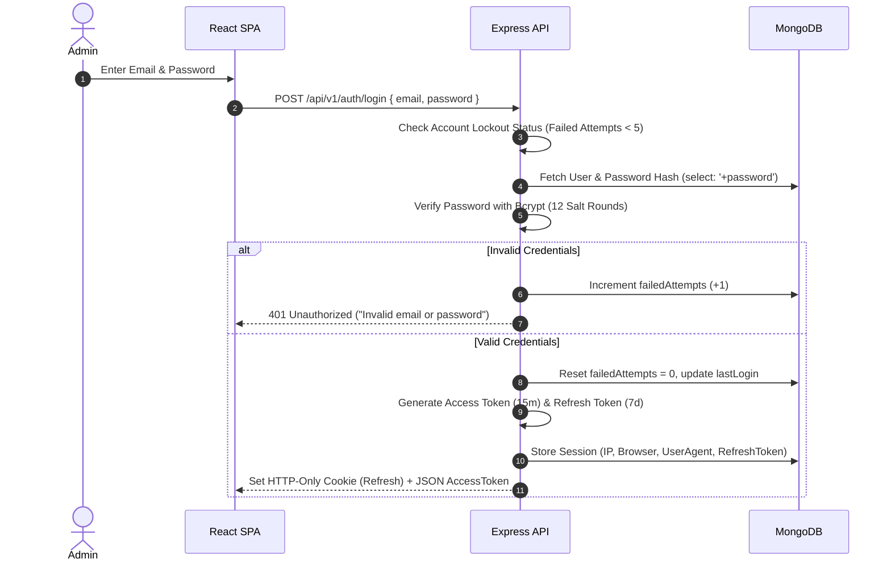

# HolidayCity - Enterprise Security Architecture & Best Practices

**Version:** 1.0  
**Status:** Approved  
**Project Name:** HolidayCity  
**Document Type:** Enterprise Security Architecture & Compliance Specification (`security.md`)  
**Core Framework:** Node.js + Express + React 19 + MongoDB Atlas + JWT + RBAC  

---

## 1. Executive Security Objectives

HolidayCity handles high-value travel lead data, customer documentation, travel itinerary metadata, and back-office administrative access. The security architecture enforces a **Defense in Depth** and **Zero Trust** strategy across all system layers.

### 🔒 Tenets of HolidayCity Security
1. **Authenticated Operations:** Strict JWT access control with HTTP-Only refresh token rotation.
2. **Protected Admin Hub:** Multi-role Granular Access Control (RBAC) governing back-office views and actions.
3. **Hardened Lead Acquisition Forms:** Multi-layer input validation, rate limiting, and NoSQL/XSS payload stripping.
4. **Data Isolation & Encryption:** Mandatory TLS 1.3 in transit, AES-256 at rest, and environment secret isolation.
5. **Full Operational Auditability:** Immutable audit logging for every administrative create, update, delete, or role change event.

---

## 2. Multi-Layer Security Architecture

```
                                    INTERNET TRAFFIC
                                           │
  ┌─────────────────────────────────────────────────────────────────────────────────┐
  │ Layer 1: Cloudflare / AWS WAF (DDoS Mitigation, IP Reputation, Web Firewall)   │
  └────────────────────────────────────────┬────────────────────────────────────────┘
                                           │
                                           ▼
  ┌─────────────────────────────────────────────────────────────────────────────────┐
  │ Layer 2: Nginx Reverse Proxy (SSL/TLS 1.3 Termination, HSTS, Rate Limiting)     │
  └────────────────────────────────────────┬────────────────────────────────────────┘
                                           │
        ┌──────────────────────────────────┴──────────────────────────────────┐
        ▼                                                                     ▼
  ┌────────────────────────────────────────┐             ┌────────────────────────────────────────┐
  │ Layer 3: React 19 Client               │             │ Layer 4: Node.js Express API           │
  │ • DOMPurify XSS Protection             │             │ • Helmet Headers & CORS Origin Lock    │
  │ • Strict Input Validation              │             │ • Rate Limiter & Zod Schema Validation │
  │ • Secure Cookie Auth Storage           │             │ • JWT Verification & RBAC Guards       │
  └────────────────────────────────────────┘             └───────────────────┬────────────────────┘
                                                                             │
        ┌────────────────────────────────────────────────────────────────────┴────────────────────┐
        ▼                                                                                         ▼
  ┌────────────────────────────────────────┐                               ┌───────────────────────────┐
  │ Layer 5: MongoDB Atlas Cluster         │                               │ Layer 6: Cloudinary S3    │
  │ • TLS Encrypted Connections            │                               │ • Signed API Uploads      │
  │ • VPC Peering & IP Whitelisting        │                               │ • MIME Type Sanitization  │
  └────────────────────────────────────────┘                               └───────────────────────────┘
```

---

## 3. Authentication & Password Security Strategy

### 3.1 Admin Authentication Workflow



---

### 3.2 Password Policy & Hashing Standard
- **Complexity Requirements:** Minimum **8 characters**, containing at least **1 Uppercase letter**, **1 Lowercase letter**, **1 Number**, and **1 Special Character** (`!@#$%^&*`).
- **Disallowed Passwords:** Common dictionary words and passwords (e.g., `123456`, `password`, `admin123`) are rejected by Zod schema validators.
- **Password Storage:** Hashed using `bcryptjs` with **12 Salt Rounds**. Plaintext passwords are never logged or stored.

### 3.3 Token & Session Management Matrix

| Token Type | Expiration | Storage Location | Security Flags |
| :--- | :--- | :--- | :--- |
| **Access Token** | 15 Minutes | In-Memory (React State) | Sent as `Authorization: Bearer <token>` |
| **Refresh Token**| 7 Days | HTTP-Only Cookie | `HttpOnly; Secure; SameSite=Strict; Path=/api/v1/auth` |

- **Account Lockout Policy:** 5 consecutive failed login attempts lock the target account for **15 minutes**.
- **Session Revocation:** Admin staff can execute "Logout from All Devices", invalidating all stored active refresh tokens for their user ID.

---

## 4. Role-Based Access Control (RBAC) Permission Matrix

Access rights are evaluated dynamically by Mongoose middleware checking the user's role against permissions:

| System Module | Super Admin | Admin | Sales Executive | Content Manager | Marketing Executive |
| :--- | :---: | :---: | :---: | :---: | :---: |
| **Dashboard KPIs** | ✅ Full | ✅ Full | ✅ Assigned Only | ✅ View | ✅ View |
| **Lead Management (CRM)** | ✅ Full | ✅ Full | ✅ Assigned Only | ❌ Blocked | ❌ Blocked |
| **Tour Packages** | ✅ Full | ✅ Full | 👁️ View Only | ✏️ Edit & Publish | 👁️ View Only |
| **Destinations Catalog** | ✅ Full | ✅ Full | 👁️ View Only | ✏️ Edit & Publish | 👁️ View Only |
| **Blog & Media Engine** | ✅ Full | ✅ Full | ❌ Blocked | ✏️ Edit & Publish | 👁️ View Only |
| **Website CMS Pages** | ✅ Full | ✅ Full | ❌ Blocked | ✏️ Edit & Publish | ⚠️ Limited Copy |
| **SEO Configurations** | ✅ Full | ✅ Full | ❌ Blocked | 👁️ View Only | ✏️ Edit Meta Tags |
| **User & Staff Accounts**| ✅ Full | ⚠️ Limited | ❌ Blocked | ❌ Blocked | ❌ Blocked |
| **System Settings** | ✅ Full | ⚠️ Read Only | ❌ Blocked | ❌ Blocked | ❌ Blocked |

---

## 5. API Middleware Hardening Pipeline

Every protected endpoint passes through a sequential validation pipeline:

```
  Incoming Request
         │
         ▼
  ┌──────────────────────────────────────────────────────────┐
  │ 1. Helmet Security Headers (CSP, HSTS, X-Frame-Options)  │
  ├──────────────────────────────────────────────────────────┤
  │ 2. CORS Policy Check (Origin Whitelist)                  │
  ├──────────────────────────────────────────────────────────┤
  │ 3. Express Rate Limiter (IP Threshold Check)             │
  ├──────────────────────────────────────────────────────────┤
  │ 4. JWT Authentication Guard (Bearer Token Verification)  │
  ├──────────────────────────────────────────────────────────┤
  │ 5. Role & Permission Authorization Check                 │
  ├──────────────────────────────────────────────────────────┤
  │ 6. Zod Schema Input Sanitization & Payload Validation    │
  ├──────────────────────────────────────────────────────────┤
  │ 7. Express Controller & Service Execution                │
  └──────────────────────────────────────────────────────────┘
```

### 5.1 Rate Limiting Threshold Rules

| Route Category | Window | Max Request Limit | Action on Exceeded |
| :--- | :--- | :--- | :--- |
| **Admin Login (`/auth/login`)** | 15 Minutes | **5 Requests** | 429 Too Many Requests + 15m Lock |
| **Public Lead Forms (`/enquiries`)**| 30 Minutes | **5 Submissions** | 429 Rate Limit Error |
| **Public Contact Form (`/contact`)**| 1 Hour | **10 Submissions** | 429 Rate Limit Error |
| **Global Read APIs (`/packages`)** | 15 Minutes | **100 Requests** | 429 Rate Limit Error |

---

### 5.2 Input Validation & Payload Protection
- **XSS Prevention:** All user-generated text inputs sanitised on client rendering using `DOMPurify`. Raw strings inside `dangerouslySetInnerHTML` are strictly forbidden.
- **NoSQL Injection Protection:** Queries sanitized using `express-mongo-sanitize` to strip `$` and `.` MongoDB operators from client parameters (`req.body`, `req.query`, `req.params`).
- **CORS Origin Whitelist:** Strictly restricted to authorized origins:
  - `https://holidaycity.com`
  - `https://www.holidaycity.com`
  - `https://admin.holidaycity.com`
- **Helmet Security Headers Config:**
  ```javascript
  app.use(helmet({
    contentSecurityPolicy: true,
    crossOriginEmbedderPolicy: true,
    frameguard: { action: 'deny' },
    hsts: { maxAge: 31536000, includeSubDomains: true, preload: true },
    noSniff: true,
    referrerPolicy: { policy: 'strict-origin-when-cross-origin' }
  }));
  ```

---

## 6. Media & Upload Security Architecture

To prevent remote code execution (RCE) via file uploads:

### 6.1 Upload Restrictions
- **Allowed Extensions:** `.jpg`, `.jpeg`, `.png`, `.webp`, `.pdf`
- **Explicitly Rejected Extensions:** `.exe`, `.bat`, `.sh`, `.php`, `.js`, `.zip`, `.html`, `.svg`
- **Maximum File Limits:** Images $\le 10\text{ MB}$, PDFs $\le 20\text{ MB}$.
- **Renaming Standard:** Every uploaded file is renamed server-side to a secure `UUIDv4` string before upload.

### 6.2 Signed Cloudinary Uploads
API keys and secrets are strictly retained within backend environment variables. Admin media uploads use signed upload presets generated by the Node.js server.

---

## 7. Database & Infrastructure Hardening

1. **MongoDB Atlas Network Controls:** IP Whitelisting restricted to AWS EC2 elastic IP addresses; TLS 1.3 mandatory for all connections.
2. **Environment Variable Protection:** Secrets (`JWT_SECRET`, `MONGODB_URI`, `SMTP_PASSWORD`) stored securely in environment files (`.env`), omitted from Git repositories via `.gitignore`, and injected via AWS Secrets Manager in production.
3. **Nginx Security Rules:** Disable directory listing, enforce request payload size limits (`client_max_body_size 25M`), and restrict HTTP methods (`GET`, `POST`, `PATCH`, `DELETE` only).

---

## 8. Audit Logging & Disaster Recovery

### 8.1 Administrative Audit Log Schema
Every sensitive operation creates an immutable audit trail:

```javascript
// Activity Log Schema Entry
{
  user: ObjectId("66a7b210f928a014e823c10a"),
  userEmail: "admin@holidaycity.com",
  module: "Packages",
  action: "UPDATE_PACKAGE_PRICING",
  recordId: ObjectId("66a7c419f928a014e823c990"),
  ipAddress: "103.21.124.8",
  userAgent: "Mozilla/5.0 (Windows NT 10.0; Win64; x64)...",
  timestamp: ISODate("2026-07-29T13:45:00Z")
}
```

### 8.2 Disaster Recovery Plan & Backup Strategy
- **Backup Schedule:** Daily automated incremental database backups + weekly full snapshots stored on MongoDB Atlas with point-in-time recovery.
- **Recovery Time Objective (RTO):** Target RTO of **$< 2$ hours** for full system restoration.
- **Incident Response Flow:**

```
  ┌──────────┐     ┌───────────┐     ┌──────────────┐     ┌───────────┐     ┌───────────┐
  │  DETECT  │ ──► │  CONTAIN  │ ──► │ INVESTIGATE  │ ──► │   PATCH   │ ──► │  RECOVER  │
  └──────────┘     └───────────┘     └──────────────┘     └───────────┘     └───────────┘
```

---

## 9. Production Security Verification Checklist

- [x] JWT access token (15m) + HTTP-Only refresh token (7d) rotation active.
- [x] Bcrypt password hashing configured with 12 salt rounds.
- [x] Account lockout active after 5 failed login attempts.
- [x] HTTPS enforced with HSTS preload enabled.
- [x] Helmet security headers active on all Express routes.
- [x] Rate limiting active on login, lead forms, and public endpoints.
- [x] Zod validation active on all request payloads.
- [x] NoSQL query sanitization (`express-mongo-sanitize`) active.
- [x] DOMPurify active on all dynamic user-rendered HTML string fields.
- [x] CORS origin locked to production domains.
- [x] File upload extensions restricted and renamed with UUIDs.
- [x] Sensitive secrets stored in environment variables and omitted from Git.
- [x] Automated daily MongoDB Atlas backups configured.
- [x] Dependency vulnerability scanning (`npm audit`) clean.

---
*End of Enterprise Security Architecture & Best Practices - HolidayCity v1.0*
